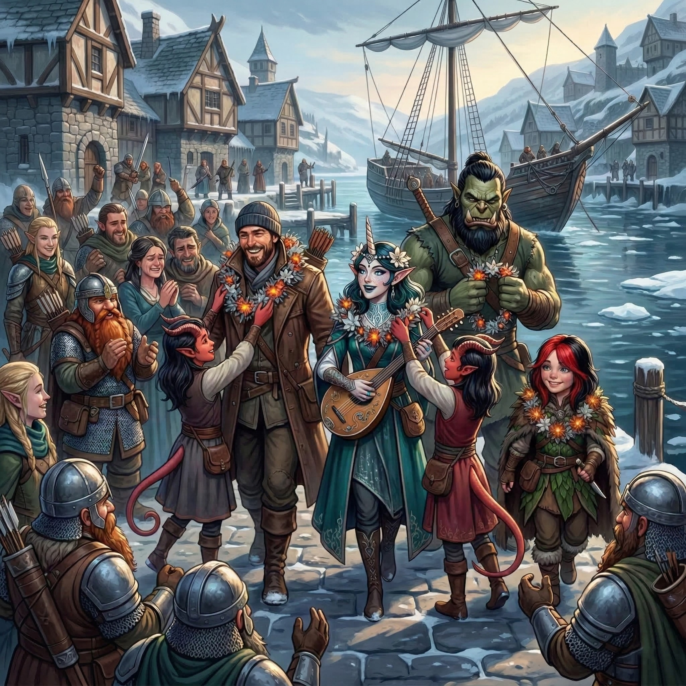

# Interlude

Flush with their newfound fortunes,
the party spent their remaining days in Syrinlya
celebrating in the primary way available
within the small outpost: drinking.
Thanks to Elara’s enchanting performances
and the adventurers’ newly minted reputation,
the sole yurt-cum-tavern was daily filled
with raucous revelry.

When the sun was at its highest
(which in the wastes of Eiselcross is not very high at all)
on the third day of their celebrations,
a band of new explorers arrived
seeking guides for an expedition into Aeor.
They offered twice the customary rate.
Whisper and Halite
were the only members of the party
awake and hangover-free
after the festivities of the night before.
Determined to take advantage of the lucrative opportunity,
they accepted the contract,
and that night said their fond farewells
to Doctor Pepe, Elara, Gerhard, Kragor, and Scarlet.

Finally, days later,
the *Remorhaz* was repaired and declared seaworthy.
The morning the party was to set sail
for Palebank Village brought one last surprise:
Gerhard’s brother arrived in Syrinlya,
having desperately searched for his lost kin.
It was a bittersweet reunion
as Gerhard recounted the tragic destruction of the *Frostfang*.
As the remaining adventurers boarded the *Remorhaz*,
Gerhard chose to stay behind,
and another heartfelt round of goodbyes was shared.
Gerhard would return to his family home in Icehaven,
using his share of their massive fortune
to rebuild his shattered life.

The voyage back across the Frigid Depths
to Palebank Village was a blessedly uneventful reprieve.
Upon disembarking, Doctor Pepe, Elara, Kragor, and Scarlet
were greeted with a heroes’ welcome,
and were overjoyed to see the smiling faces
of the Liel-Tethwick family,
spared from the icy grip of the Woe.
The twin tiefling daughters, Honor and Magic,
touchingly bestowed their gratitude
by draping the adventurers in woven garlands
of frost-kissed embers, ghost-pine blossoms,
and other native flowers.

That night, a great celebration was held
at the Jolly Dwarf tavern,
where the gathered crowd chanted Elara onto the stage.
The aasimar bard delivered a beguiling performance
that mythologized their harrowing quest:
she sang of Old Croaker,
the doomed priestess of Tiamat,
the giant squid, the octopus, and the scuttling crabs.
She wove verses of the oppressive cold of Foren,
the raging heat of the remorhaz,
the surprising River Inferno,
and the mysterious elemental prison.
She detailed the deadly dance of animated armors and knives,
and the undead menaces of Salsvault
commanded by their wight master.
Discreetly, she omitted any mention
of the white dragon egg.
As her song reached its crescendo,
she proclaimed to the cheering room,

> | The frost is broken, the sickness fled,
> | We walked the halls of the frozen dead!
> | So raise your glasses, let the rafters bend,
> | And drink to the heroes of Woe’s End!

In the weeks that followed,
the party decompressed in the village,
trading the adrenaline of survival
for quiet contemplation.
All, that is, except for Doctor Pepe,
who seemed intent on squandering every copper
on whatever hedonism Palebank could offer.
A barely-bearded dwarven pelt-sharer named Thilda
became the primary, exhausted beneficiary
of the rogue’s lavish spending.

Meanwhile, Kragor bore his secret burden
a two days’ march from the village,
finding a secluded, pine-choked ravine
far enough away to avoid the eyes of hunters or patrols.
There, in a permafrost bank
beneath the gnarled roots of a dead ironwood tree,
he stowed the white dragon egg,
hoping to keep it safe from molestation.
Each week thereafter, he made the arduous trek to the site,
sometimes alone, sometimes shadowed by one of his companions,
to check on the dormant terror’s well-being.

On the third week,
on one of his solo journeys,
Kragor arrived to find the shell shattered.
Following tiny, clawed tracks through the snow,
he soon found the newly hatched wyrmling,
whom he quickly dubbed “Rimeflake”.
Over the next few days,
the orc warlock fed the ravenous beast
from his own rations of dried jerky,
marveling at its unnatural, terrifying rate of growth.
Nightly, Kragor stood a tireless vigil,
determined that no roaming frost giants,
ogres, or other northern tyrants
would capture and enslave this monstrous orphan.

Finally, its wings strong enough to bear the wind,
Rimeflake offered a guttural grunt
that Kragor chose to interpret as a farewell,
before taking off for the frosted hillsides.
The orc begins to trudge slowly
back to Palebank Village,
feeling a strange, hollow satisfaction.
