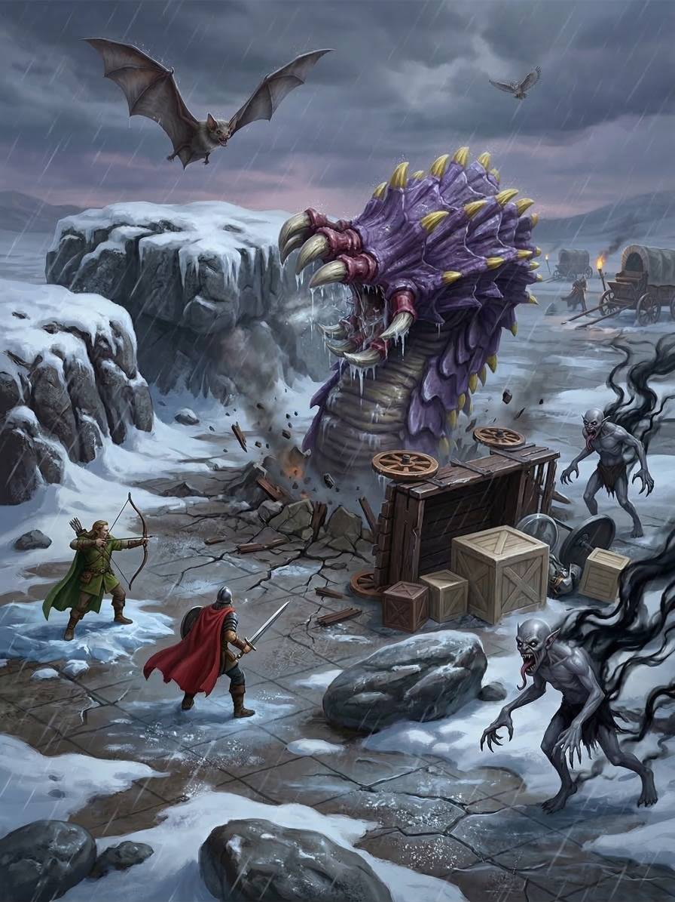
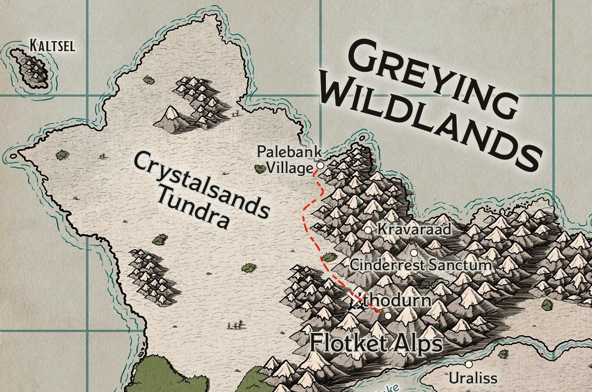

# The Road to Uthodurn

When Kragor finally returned
to the frost-rimed doors of the *Jolly Dwarf*,
he found his companions waiting
with equal parts relief and frustration.
The orc warlock recounted his secret vigil
over the white dragon egg,
speaking fondly of the newly hatched wyrmling
he had dubbed “Rimeflake”.
While the party offered their support
for his unlikely and terrifying “parenthood”,
Doctor Pepe could only grumble,
muttering that Kragor was exceedingly lucky
the beast hadn’t made a meal of him.

The adventurers turned their attention
to their newfound wealth and future prospects.
Palebank Village, for all its rugged charm,
offered little in the way of high-end merchants.
They debated their next destination:
should they return to Icehaven,
the port of their initial arrival?
Or perhaps Nogvurot or Grimgolir,
though reaching them meant braving
the Quannah Breach
and the steep tolls of the Uttolot crime family?
Or perhaps Uthodurn,
the grand mountainside city
where their rising reputations might open doors?

As they weighed their options,
Elro Aldataur entered the tavern,
his weathered eyes scanning the room
until they locked onto the party.
The village leader approached with a lucrative proposition.
A recent expedition to Eiselcross had returned
with a powerful Aeorian artifact,
one whose strange, lingering magic
disrupted the teleportation box
typically used to send such relics to Uthodurn.
Instead, it had to be transported overland
hidden within a mundane supply caravan.
Elro had secured an escort of six Glassblades—
the finest guards the village could spare—
but he desired the proven might of the adventurers
to guarantee the artifact’s safe arrival.
He offered seventy-five gold pieces to each of them,
provided they kept the true nature of their cargo a secret
shared only with the Glassblade captain.
The caravan would depart in two days,
and the journey would take a tenday.
The party accepted without hesitation.

Anticipation for the grandeur of Uthodurn
made the final days in Palebank Village
drag with an agonizing slowness.
Each of the adventurers made their preparations
for the tenday trek in their own way.
Doctor Pepe dedicated his remaining hours to Thilda,
employing every ounce of his roguish charm
in a futile attempt to coax the exhausted dwarven pelt-sharer
into joining their overland expedition.
Elara busied herself choreographing a new one-aasimar show;
armed with her hand drum
and clad in a flamboyantly oversized fur ensemble,
the bard meticulously rehearsed her routine,
ready to unleash it when the perfect moment arose.
Kragor quietly repacked his gear,
unthreading the heavy, custom straps
that had previously secured the white dragon egg.
As he hoisted the bag onto his shoulders,
the orc warlock let out a wistful sigh
at its noticeably lighter heft.
At the edge of the village,
Scarlet scanned the subtle omens of the wilds,
studying the biting winds and shifting clouds
to divine what weather the unforgiving northern trail
might have in store for them.

## The Caravan

On the morning of their departure,
the adventurers arrived
at the village gates
to find the caravan already assembling.
At its head stood Captain Mireth Copperleaf.
Standing a stout five-foot-two,
she was unmistakably an Attalwen,
bearing the delicate, angular features of an elf
paired curiously with a finely trimmed, thin beard.
Beside her stood Sergeant Dolgrim Ashward,
a grizzled dwarven veteran
whose black, silver-streaked beard
framed a face bisected by a jagged scar across his nose.
Standing alongside the veteran officers was Therin,
an imposing dragonborn cleric
whose armor proudly bore the platinum crest of Bahamut.
Lacking the official insignia of the village guard,
the devout warrior was an independent sword-for-hire,
contracted to protect the caravan
much like the adventurers themselves.
A hardened cadre of elven and dwarven Glassblades
rounded out their escort.

Behind the guards sat three heavy supply wagons,
though they were not hitched to traditional draft horses.
Instead, the harnesses were strapped
to magnificent beasts
the party would soon learn were called Flot goats (Cliffneck goats).
Standing nearly eight feet tall,
the creatures were remarkably squat and barrel-chested,
giving them a formidable, rounded silhouette.
They were mountains
of muscle and thick, shaggy fur,
standing on meaty legs
and sporting heavy, inward-curving ram horns
that crested above thick, wreath-like ruffs of hair around their necks.

Following a round of brief introductions,
the caravan rolled out of Palebank Village
and ventured into the harsh expanse of the Crystalsands Tundra.
The landscape before them was a sprawling, frozen desert,
its dunes composed of tiny, sandy, crystalline beads of ice.
Strange, rocky outcroppings and oddly shaped pillars of earth
pierced the endless white like broken teeth.
Their first day on the trail proved punishing;
howling winds sweeping off the ocean
blasted the caravan with a relentless, stinging barrage of ice
that served as a constant irritant to the travelers.

Seeking distraction from the bitter cold,
the party spent the trek mingling with their new traveling companions.
Over the roar of the wind,
they acquainted themselves with the other Glassblade guards—
veterans Talindra Snowveil, Oryn Hammerglass, and Faelan Duskwood,
alongside an eager new recruit named Brennik Coalvein.
They also met the hardy teamsters
tasked with guiding the massive Flot goats:
Tomás Veer, Hildra Bronzebuckle, and Caelynn Whisperwind.

Falling into step beside Sergeant Dolgrim,
Kragor initiated a conversation in fluent Dwarvish,
inquiring about potential hazards along their route.
The grizzled sergeant gruffly advised him
to keep a sharp eye out once they reached
the treacherous foothills of the mountains,
where ambushes were most likely.
To pass the time,
Kragor shared tales of the party’s perilous trek across Foren,
lingering on their unsettling encounters with the deranged local wildlings.

Dolgrim nodded with grim recognition,
identifying the savages as a fanatic cult known as the “Mawcotters”.
He explained that these zealots undertook
an annual, obsessive pilgrimage
into the wastes of Eiselcross
to harvest flesh from the corpse of a colossal, frozen worm.
The cultists would then bring the meat back to their kin,
ritualistically devouring it in dark communion.

As the dwarf shared this grisly lore,
Kragor shuddered beneath his heavy furs.
The explanation cast a horrifying new light
on his memories of the wildlings’ captives.
He remembered how the prisoners
had initially thrashed and begged the party for rescue,
only to undergo a deeply unsettling transformation.
The once-desperate captives had become
unnervingly placid, assimilated members
of the tribe who smiled serenely
and urged the adventurers to partake of the meat themselves.

The caravan’s journey across the Crystalsands Tundra
stretched into a grueling six-day march.
Each evening, as the pale sun dipped below the horizon,
the travelers circled the wagons
to establish a sprawling, fortified camp.
The crew proved to be a hardy, boisterous lot,
heavily relying on passed flasks of potent spirits
to keep the creeping northern frost at bay.
Around the roaring campfires,
worn decks of cards were frequently shuffled and dealt.

On the bleak morning following their first camp,
Kragor could be seen performing a deeply unsettling ritual.
Reaching into the darkest, flickering periphery of the campfire’s light,
the orc pinched the very darkness between his thick fingers.
With deliberate precision,
he pulled taut strands of pure shadow from the gloom,
twisting and weaving the umbral threads
until they coalesced into a slender set of tattooist’s needles.

Stripping back his heavy furs,
Kragor set to work tending to the intricate ink marring his flesh.
These markings were no ordinary pigment;
they were the literal intersection of the orc’s skin
with unfathomable, alien objects
that resided primarily within the depths of the Far Realms.
Wielding the shadowy needles,
he meticulously hooked the lines of ink,
physically rotating and dragging the designs across his body.
With each prick, he shifted and reconfigured
their insane, headache-inducing geometry into new, maddening patterns.

When the painstaking adjustments were finally complete,
Kragor carefully stowed the shadow-needles
into a small, secure pouch kept closely guarded against his torso.
They were a vital implement to his arcane arsenal;
should he lose the shadowy tools,
which act as tuning forks or eldritch antennae,
the shifting tattoos would immediately lose their tethered power.
It was this impossible, ever-changing geometry
that served as a conduit to the unknown,
granting the warlock access to a myriad of cantrips and magic rituals
that he would not ordinarily possess.

During a calmer stretch of the march,
the adventurers took the opportunity
to inspect the middle wagon,
the heavily guarded transport housing their secret charge.
Veterans Faelan and Talindra kept a watchful eye
as the party peered beneath the canvas canopy.
Resting securely within the wagon bed
were two sturdy lockboxes:
one a modest, iron-banded coffer,
and the other a considerably larger, reinforced chest.
It was within this heavier, oversized trunk
that the strange and powerful Aeorian artifact
had been carefully sealed away.

Ever the opportunist,
Doctor Pepe directed his lavish, roguish charms
toward Captain Mireth.
However, his attempts to woo the stoic Attalwen commander
were entirely unsuccessful,
met only with steely, unimpressed glares
that left his ego as bruised as the tundra ice.

The wastes themselves
proved as fickle as they were unforgiving.
A few days brought deceptively beautiful, spring-like weather,
the bright sun gleaming off the crystalline dunes.
Yet, even under clear skies, danger loomed.
During one such afternoon,
the party spotted the terrifying silhouette
of a massive winged beast
soaring far to the south.
Faelan Duskwood squinted at the horizon
and grimly suggested it might be Gelidon,
the fabled Nightmare in Ivory.
The elven veteran warned
that if the ancient white dragon caught their scent,
she would surely set her ravenous sights
on making a meal of their meaty Flot goats.

The reprieve of clear skies was inevitably short-lived.
Subsequent days brought blinding whiteouts,
with heavy, driving snow reducing visibility
to a mere five feet and forcing
the exhausted travelers to dig their buried tents
out of the drifts each morning.
When the snow finally broke,
it was replaced by a dense, freezing fog
that slowed their progress to an agonizing crawl.

## Ambush

On the evening of the seventh day,
as the caravan pushed into the jagged foothills
where the Crystalsands Tundra gives way to the Flotket Alps,
they endured a miserable,
wind-whipped trek through relentless freezing rain.
Dusk was just beginning to settle over the dreary landscape,
and the teamsters were preparing to call a halt for the night.
Suddenly, the icy quiet was violently shattered.
A deafening *boom* erupted from the front wagon,
echoing like thunder across the frozen wastes.

In a terrifying instant,
the lead wagon was hurled
several feet into the freezing rain,
crashing down onto its side,
killing the teamster Tomás instantly.
From the shattered earth beneath it,
an enormous purple worm surged upward,
its massive, plated bulk towering thirty feet into the frigid air.

Amidst the chaos of the beast’s eruption,
several horrifying figures materialized from the gloom.
They were humanoid, yet unnervingly alien,
stalking forward with absolute silence.
Their pale gray skin stretched tightly over bald heads,
framed by hooked, pointed ears.
Long, jagged teeth and dangling tongues
spilled from their slavering maws,
while elongated, lanky limbs ended in cruel, clawed fingers.
As they moved, inky tendrils of darkness
trailed behind them like shadows ripped from the night.

Flanking these nightmarish monstrosities
came a terrifyingly swift mount
that resembled a massive, sabre-toothed panther.
Astride the beast rode a silent warrior
draped in elegant gold and crimson silks,
their expressionless face possessing the dry, drawn look of old parchment.

Sensing the true target of the ambush,
the dragonborn cleric, Therin, sprinted toward the middle wagon,
desperately intending to grab the artifact’s chest and retreat.
But the panther-riding warrior was blindingly fast.
The mount closed the distance in a blur,
and with two devastating, sweeping chops of a wicked glaive,
the rider downed the devout warrior,
the cursed blade visibly draining the life force from Therin’s heavy frame.

Nearby, two of the shadow-trailing ghasts
lunged fiercely at Captain Mireth.
Thinking fast, Elara wove her bardic magic,
singing a desperate lullaby to force them into slumber.
Her spell caught hold of one of the creatures,
sending it collapsing limply into the freezing mud.

However, two more of the lanky ghasts
bounded toward Kragor and the bard.
The orc warlock bore the brunt of the assault,
suffering a brutal tearing of claws and a vicious bite.
Though badly wounded, Kragor strained through the pain,
narrowly fighting off a creeping, icy paralysis
that threatened to lock his limbs.
In immediate retaliation, his *Armor of Agathys* flared,
biting back at the ghast with supernatural frost.
Kragor followed up with a sweeping cut from his longsword.
Joined by a dazzling *Starry Wisp* conjured by Elara,
the pair thoroughly bloodied the towering creature.

Yet, the sheer ferocity of the ambush was overwhelming.
The remaining shadow-ghasts swarmed Captain Mireth,
pulling down the stoic commander
along with the rest of the veteran Glassblades
and the hardy teamster, Hildra.
Only Caelynn managed to slip into the blinding rain and flee.

Doctor Pepe, for his part,
had slipped behind a nearby rock outcropping
at the first eruption of chaos,
crouching low with blade drawn and senses sharpened.
From his sheltered vantage,
he watched the carnage with practiced patience,
waiting for the opportune moment
a seasoned rogue always expects will come.
It never did.
Every opening closed before he could act,
the slaughter too swift,
too ruthless and decisive
to offer any gap worth exploiting.

Seeing the massacre unfolding,
Elara called out a melodic *Healing Word*,
knitting Therin’s wounds just enough to revive him.
The battered dragonborn scrambled upright,
swiftly putting distance between himself and the deadly skirmish.
Seeing that they were hopelessly outmatched
and unable to reach the falling guards,
Kragor grabbed Elara by the arm
and hauled the bard through the freezing rain toward safety.

With the defenders scattered and broken,
the expressionless rider in crimson silk
effortlessly retrieved the heavy chest
containing the Aeorian artifact.
Securing the prize, the rider bolted away into the stormy gloom.
As if guided by a singular, unseen command,
the towering purple worm and the surviving shadowy ghasts
melted back into the dark and driving rain,
leaving the frozen tundra in sudden, devastating silence.

## Aftermath

Through the biting squall,
the scattered adventurers eventually found one another,
trudging back to the gruesome site of the massacre.
Kragor and Therin,
each battered but resolute,
immediately searched the middle wagon,
hoping against hope that their secret charge had been spared.
Predictably, the heavy, reinforced trunk was gone,
stolen away into the freezing dark.
However, the second, more modest coffer remained.
Prying it open, they discovered a finely crafted dagger
alongside a grapefruit-sized Aeorian object secured in a box.
Taking a moment amidst the howling wind,
Kragor performed a ritual to reveal unseen auras,
confirming that the blade pulsed with latent magic.
Wary of further treachery,
Therin solemnly claimed the chest,
placing the surviving valuables under his staunch protection.

Meanwhile, the rest of the party—
Doctor Pepe, Elara, and Scarlet—
scoured the stormy gloom for any signs of life.
Their calls through the freezing rain
eventually coaxed the teamster Caelynn
from her desperate hiding place.
Turning their attention to the lead wagon,
which had been utterly decimated by the purple worm,
they made a grim discovery.
Several mangled corpses lay pinned beneath the shattered wood,
but a faint groan revealed one survivor still clinging to life.
Kragor and Therin quickly hurried over,
and together, the entire party strained with all their might
to heave the heavy debris aside.
From the muddy, blood-stained ice,
they pulled the young recruit, Brennik Coalvein.
Scarlet rushed to his side,
channeling swift healing magic to close his grievous wounds,
leaving the battered guard overwhelmed with gratitude.

Once the shock had begun to settle,
the survivors huddled together in the miserable downpour
to piece together the nature of their attackers.
Drawing on her knowledge of the wilds,
Scarlet identified the terrifying, panther-like beast
as a Moorbounder—a fierce predator native to Xhorhas,
often bred, trained, and ridden as a fearsome mount.
Therin grimly recounted his brief clash with the rider,
describing a vaguely humanoid figure
whose expressionless face looked as though dry, brittle parchment
had been stretched and pasted over bone.
Still trembling from his near-death experience,
Brennik confirmed the identity of the colossal subterranean beast.
He explained that massive purple worms
were occasionally employed by the Kryn Dynasty,
utilized to travel vast distances deep underground
and unleash sudden, devastating destruction upon their enemies.

With their commanding officers dead
and their priceless cargo stolen away,
there was nothing left to do but press onward.
They would have to continue the grueling trek to Uthodurn
and deliver the grim tidings to the Diarchy themselves.
Working through their bone-deep exhaustion,
the battered party scraped together the meager remains
of the mundane caravan supplies—
scattered crates of thick furs and dried fish—
and solemnly prepared a wary camp
to rest and recover through the unforgiving night.

## Kord

The freezing rain persisted into the bleak dawn,
turning the rugged trail into a treacherous slick of mud and ice.
Progress the next day was agonizingly slow
as the battered caravan trudged deeper into the jagged foothills.
Looming mountains began to close in on either side,
casting long, oppressive shadows over the surviving travelers.

As they navigated a narrow pass,
Scarlet’s keen eyes caught
a subtle break in the harsh terrain:
a weathered trailhead branching off to the right,
winding steeply up into the icy crags.
The exhausted party called for a much-needed rest,
but Kragor and the dragonborn cleric, Therin,
volunteered to push through the biting chill
and scout the ascending path.

The climb was punishing,
their boots slipping over frost-heaved stone,
but the arduous trek eventually opened onto a secluded plateau.
Dominating the center of this lonely peak
stood a monolithic stone tablet,
acting as a crude but imposing altar.
Kneeling before the ancient stone,
Kragor murmured the familiar syllables of his ritual,
adjusting his sight to peer beyond the veil.
The warlock’s eyes widened as the stone bloomed
with a faint pulsating aura of divine magic.

Stepping beside him,
Therin brushed a layer of rime from the weathered carvings,
his golden eyes recognizing the harsh, jagged iconography.
The devout warrior solemnly declared it a forgotten shrine
to Kord, the Stormlord—god of battle, roaring tempests, and unyielding strength.

At the name of the Stormlord, Kragor stiffened.
Beneath the heavy layers of his furs and armor,
the orc’s thick fingers instinctively reached up
to clutch an old, chipped amulet resting against his chest.
It was his most treasured memento:
a keepsake from his mother,
a proud woman who had honored the Lord of Storms in absolute secrecy
amidst the oppressive, militaristic confines of Bladegarden.

A thorough search of the windswept plateau yielded no tangible treasures,
and as the howling winds intensified,
Therin turned to head back to the waiting party.
Kragor started to follow, but hesitated.
Drawn by a sudden, undeniable pull,
the warlock stepped back to the towering altar.
Pulling the battered amulet from beneath his tunic,
he pressed the chipped heirloom
against the face of the massive tablet,
keeping his fingers firmly wrapped around it.

Instantly, a profound, thrumming warmth surged from the ancient stone,
flowing up Kragor’s arm and flooding his chest.
As the supernatural heat built to a crescendo,
the howling of the wind seemed to fade away,
replaced by a sudden, crystalline vision of his mother.
Her face—proud, fierce, and unbowed—appeared in his mind’s eye
as clearly as if she were standing right before him in the snow.

Slowly, the vivid memory dissolved,
but the radiant warmth did not completely fade.
It settled deep within his marrow,
an invisible, thrumming aegis
that easily repelled the biting mountain frost.
Tucking the amulet safely back beneath his armor,
Kragor turned and descended the rocky trail
to rejoin his companions, his steps noticeably lighter,
fortified in body and spirit by the lingering blessing of the Stormlord.

## Arrival

Rejoining the weary travelers,
Kragor and Therin found the caravan
already preparing to push higher into the jagged peaks.
Despite the clinging chill and the persistent ache of their wounds,
they made remarkable progress through the rest of the day.
Driven by a desperate need for sanctuary,
the survivors coaxed the remaining Flot goats ever upward,
slowly but surely ascending the treacherous,
frost-slicked switchbacks of the mountainside.

As dusk began to bleed the color from the sky,
painting the snow-capped peaks in deep violets and bruised blues,
the time came to make camp for the night.
The teamster Caelynn
had just begun scouting for an outcropping
to block the wind when Brennik spoke up.
The young recruit,
still favoring his battered side but looking more resolute than ever,
surveyed the familiar contours of the surrounding ridges.
His breath plumed in the frigid air as he announced that,
by his closest estimate,
they were now no more than two hours out from Uthodurn.

The exhausted caravan members gathered together,
exchanging weary but determined glances.
The prospect of spending another miserable,
freezing night looking over their shoulders in the dark
was thoroughly unappealing.
With a unanimous, silent nod passing between the adventurers,
Therin, and the surviving crew,
they decided to forgo rest and push onward through the encroaching night.

Those last agonizing hours of the trek proved to be entirely uneventful,
yet the air was thick with a breathless anticipation.
The howling winds seemed to quiet
as they navigated the final, winding mountain pass,
every crunch of snow under hoof and boot
bringing them closer to safety—
and to the daunting task of delivering their grim tidings to the Diarchy.

At last, the steep path opened
onto a massive, leveled plateau,
and the grand gates of Uthodurn finally came into view.
Hewn directly into the sheer face of the mountain,
the city’s entrance was a breathtaking marvel of dual craftsmanship.
Immense, towering doors of dark, polished stone
were intricately inlaid with elegant, sweeping veins of mithril
that caught the pale moonlight, shimmering like captured starlight.
Massive statues flanked the approach—
one depicting a stoic dwarven paragon wielding a great hammer,
the other a lithe elven sentinel resting upon a curved blade—
serving as eternal, silent guardians of the subterranean domain.
Above, warm, inviting amber light spilled from the high watchtowers,
a stark and welcoming contrast to the merciless blue ice of the wilds behind them.

Hobbling forward to the front of the ragged procession,
Brennik cupped his hands around his mouth
and hailed the heavily armored sentries
positioned atop the battlements.
His voice, though hoarse,
carried clearly across the quiet plateau
as he identified himself
as a Glassblade of Palebank Village
and desperately outlined the tragic fate of their diplomatic mission.

A flurry of urgent activity erupted along the wall.
Deep, resonant horns sounded a solemn note of entry,
and with a profound, earth-shaking rumble
of hidden gears and ancient counterweights,
the colossal mithril-veined doors began to slowly part.
A cadre of Uthodurnian guards quickly spilled forth into the snow,
their expressions a mix of suspicion and concern
as they made ready to receive the bloodied survivors and their exhausted beasts.

As the adventurers crossed the monumental threshold
into the echoing, cavernous warmth of the great mountain city,
they released a collective breath they hadn’t realized they were holding.
They had survived the unforgiving tundra and the horrors of the ambush,
but as the grand stone doors ground shut behind them,
they knew their true trial—
navigating the complex, shining courts of Uthodurn
to explain the loss of a priceless Aeorian relic—
was only just beginning.
