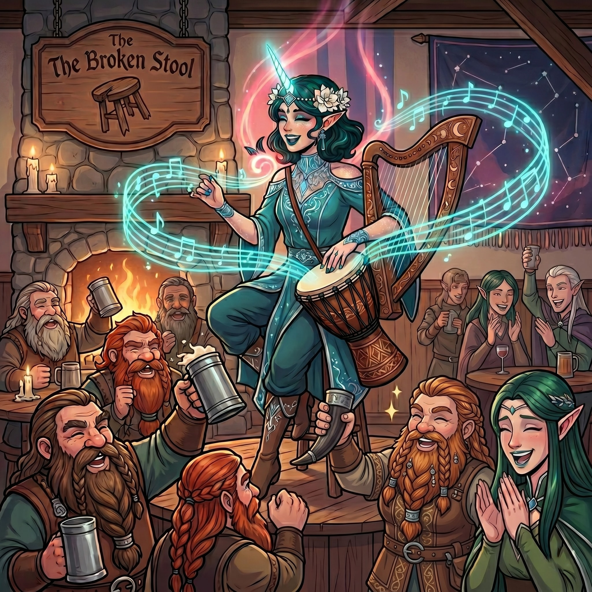

# Dust and Diplomacy

:::summary
In which our well-meaning companions set about the delicate business of subterranean archaeology, only to suffer the momentous inconvenience of accidentally disintegrating an eight-hundred-year-old wizard when his frightfully fragile soul-vessel simply snapped under the lightest pressure. Dusting themselves off from this minor faux pas, they faced the equally harrowing ordeal of avoiding the total confiscation of their ill-gotten treasures by the newly arrived authorities, a feat managed through a masterful deployment of polite half-truths. Retreating to the civilized surface for stiff drinks, whimsical shopping, and a brisk musical interlude, they soon found themselves summoned to the Vellum Steeple, where they executed a marvelously deceptive surrender of a single lead-covered book to appease the archivists while quietly pocketing the rest of their magical spoils. Yet, this bureaucratic triumph was merely the preamble to the day’s true peril: a remarkably tense diplomatic summit convened at a comically oversized dining table. Here, armed with little more than impeccable posture and a distressing tale of an undead ambush, they navigated a frightful standoff between the Uthodurnian ministers and a defensive Kryn Taskhand, ultimately agreeing to trundle off into the untamed wilderness in search of a purloined purple worm, buoyed by the promise of heavy coin and some exceptionally sturdy goats.
:::

“Your master,” he said.

Kragor’s words hung in the stale, dust-moted air of the subterranean study. The homunculus, still perched amid the ruins of his master’s study, seemed deeply relieved that someone had finally asked the right question. With the monstrous demon now nothing more than a foul stain on the masonry of the adjacent chamber, and the towering ruby golem standing perfectly docile under the sway of Scarlet’s newly acquired amulet, the battered adventurers could finally catch their breath and direct their attention to the creature.

Stepping closer to the heavy wooden desk, Doctor Pepe politely inquired what they should call their new, bat-winged informant.

_“Fatso called me Flea,”_ the creature squeaked in Abyssal, Doctor Pepe obligingly translating. _“I hated that guy.”_

When Kragor bluntly asked the creature what would happen if they were to simply smash the cracked crystal vial resting on the desk, Flea was instantly aghast. The homunculus frantically insisted that his master’s essence was currently trapped inside it. Seeking an alternative way to help, Doctor Pepe asked what the trapped wizard might require. Flea suggested that his master needed to eat. The rogue dutifully produced a standard trail ration and offered it to the desiccated corpse, an act of profound, if misguided, charity that unsurprisingly failed to provoke a response from the eight-hundred-year-old husk.

Leaving the wizard to his fasting, the adventurers fanned out to investigate the subterranean laboratory. The study held several curious apparatuses. Above the desk hung a dark, horn-shaped object of channeled glass on a silver chain, its tapered end pointing directly at the seated wizard. Nearby stood two brass lanterns fitted with hand-blown glass, their iron reservoirs filled with dull, expended green lumps.

While the others examined the study, Doctor Pepe and Therin announced their intention to investigate the remaining chambers. At that, Kragor reached out with his mind, forging a silent, telepathic link with the rogue to ensure they could safely share any discoveries.

Doctor Pepe and the cleric then crossed the hall and entered an adjoining bedchamber, finding its contents remarkably well-preserved despite the centuries. Inside, they spotted a sturdy armoire, a heavy chest, and a rather pristine mirror. The looking glass, in particular, captured their attention, seeming almost out of place in the ancient subterranean lair. Exercising an abundance of caution, Doctor Pepe used his telepathic connection to mentally summon Kragor over to sweep the room for magic before they disturbed anything. He soon arrived and set about performing a meticulous ritual to reveal the room’s secrets. Not ones to stand idly by, Doctor Pepe and Therin left Kragor to his chanting and passed through the study to explore an adjoining workshop.

The workshop housed a small smithy alongside vats of ancient, hardened liquid. From a workbench, Therin claimed a set of fine tinkering implements. Nearby, Doctor Pepe spotted a dense manual that appeared to be dedicated to the crafting of sharpening tools. Calling upon his enchanted ring to decipher the text, the rogue leafed through the pages. He quickly realized, however, that the tools the tome discussed were complex artifacts beyond his current understanding.

## Kaspien’s Secrets

Meanwhile, back in the study, Scarlet and Elara had focused their attention on a heavy, lead-covered tome resting on a stand, surrounded by towering bookcases filled with handwritten Draconic texts. The tome’s pages were brimming with intricate arcane diagrams. Unable to decipher the writings, Elara called out for Doctor Pepe. Prompted by the summons, the rogue and the cleric left the workshop and returned to the study. Employing his enchanted ring once more, Doctor Pepe translated the heavy tome. He discovered that the book detailed a vast array of complex magics and was currently opened to a meticulous section concerning the preservation of one’s essence outside the physical body in perpetuity. The pages featured precise sketches of the two brass lanterns and the dark, horn-shaped glass device suspended above the desk; the text referred to the latter as an “essence concentrator.” The text also revealed that the dull green lumps left inside the expended lanterns were residuum, a profoundly potent magical substance used to fuel the wizard’s harrowing ritual.

While the books were being translated, Therin took the opportunity to get a closer look at the dark, horn-shaped glass object suspended above the desk. He noted not only its ominous alignment with the seated wizard, but also an unnatural, radiating coldness that clung to its strangely organic curves.

Their scholarly pursuits were soon interrupted by a silent, telepathic summons from Kragor. The warlock had finished his meticulous sweep of the bedchamber and invited Doctor Pepe back to the bedroom to investigate the furniture. Once the rogue arrived, the orc informed him that the only arcane presence in the room was a localized aura of illusion magic radiating from the looking glass. Stepping before it, Doctor Pepe discovered its beguiling secret: the mirror magically enhanced the appearance of anyone reflected within it, presenting a fantastically flattering version of the viewer.

Tearing his gaze away from his own handsome visage, the rogue set to work. With Kragor standing watchfully over his shoulder, Doctor Pepe expertly picked the locks of a sturdy armoire and a heavy chest. Inside, they discovered a handsome collection of gems—amber, garnet, moonstone, and alexandrite—alongside a pouch of fine gold dust and a silver disk with an enameled icon on one side and “Kaspien Vohlkrist” written in old Zeidel on the other. With practiced sleight of hand, Doctor Pepe slipped a valuable jet-black pearl into his own pocket. It would have been a masterful, unseen bit of thievery, had Kragor not been watching his every move from inches away. The warlock caught the theft perfectly, but allowed it with an amused chuckle. The rogue’s final check beneath the bed yielded only a pair of hopelessly unwearable leather boots.

Before leaving the bedroom, they decided to lug the heavy mirror back into the study. There they made a startling discovery: when angled toward the desk, the mirror reflected Kaspien Vohlkrist as he was in life, rather than the husk sitting before them. Their investigation of this fascinating magical window into the past was briefly derailed when Elara caught her own reflection. The mirror’s illusory magic was of a highly flattering nature and she found herself captivated by her own absolutely fantastic visage.

As Kragor continued his search of the chambers, he opened his mind to the unseen currents of arcane energy. Sweeping his gaze across the study, he was struck by a dazzling, overwhelming array of magical auras. The room practically vibrated with lingering enchantments representing nearly every conceivable discipline of the arcane arts. Yet, amidst this brilliant unseen tapestry, the heavy, lead-covered tome his companions had been studying stood out for a different reason: it was a stark, unnatural void, completely devoid of any magical signature. Sifting through the magic-saturated room, Kragor uncovered an ornate rod inlaid with wire and capped with brass finials, along with a sealed bone scroll case that radiated its own distinct energy. Moving on to the workshop that Therin and Doctor Pepe had explored earlier, the warlock’s attuned eyes spotted a stash of valuable arcane components. He gathered four ounces of a greenish-white crystalline powder, six solid chips of the same material, and a sealed glass jar filled with a thick, green-black liquid that induced a vague sense of nausea upon sight.

## The Arrival of the Glassblades

Returning to the group with his findings, Kragor sought out Scarlet and quietly questioned her about the ruby amulet she had used to pacify the towering golem. Before the conversation could go much further, however, the deep, mechanical rumble of the mine’s elevator interrupted the quiet of the subterranean lair. The reinforcements had arrived.

Thinking quickly, Elara stepped into the hallway and conjured a clever mirage, projecting a false wall to seal off the circular chamber from the rest of the laboratory and buy them a few moments of privacy. Therin joined her. Fearing the approaching soldiers might confiscate the wizard’s fragile soul-vessel, Kragor decided to secure it. Murmuring an incantation, he summoned a spectral hand and commanded it to gently lift the crystal vial from the desk.

It was a terrible idea.

The instant the magical pressure grasped the already-fractured glass, the vial snapped cleanly in two. The trapped spark of green light flared briefly and vanished. Kaspien Vohlkrist’s body instantly collapsed into a pile of dry dust and Flea the homunculus simply popped out of existence, his tether to the mortal plane permanently severed. For a moment, Kragor, Doctor Pepe, and Scarlet stared in stunned silence at the sudden pile of ash.

With mixed feelings about the wizard’s fate, Kragor left the study and joined Elara and Therin in the hallway. Huddled together, the trio peered through the deceptive veil of the illusory wall, keeping a close watch on the circular chamber.

As the heavy mechanical rumble of the elevator subsided, the sound of approaching boots echoed in the tunnel. Safely hidden behind her magical mirage, Elara watched as the Glassblade reinforcements cautiously filed into the chamber and looked around for a few moments. The heavily armed dwarven and elven soldiers immediately spotted the towering ruby golem. Weapons were drawn in a flash of steel and the cavern filled with a chorus of startled curses in Dwarvish and Elvish as the troops fanned out, preparing for a brutal battle. They held their ground, shields raised and weapons readied, but the giant construct simply stood frozen, completely unresponsive to their presence. Confusion slowly replaced their initial panic. Finally, as the soldiers realized the golem was not moving, they relaxed and started to put their weapons away. At that moment, Elara and Kragor entered.

Drawing upon her divine heritage, the bard sprouted glowing wings and flew directly through her illusory wall, her cape billowing dramatically. The warlock casually strolled out behind her while Therin held back in the hallway. Recognizing Brennik and his father Torvin among the ranks, Elara dismissed the mirage. The father and son immediately stepped forward and began to inquire how the adventurers had fared when the commanding Glassblade, a stern female dwarf, halted them with a sharp gesture. She introduced herself as Hilda Brackmar. Shortly after, the rest of the party joined them in the chamber.

Faced with Hilda’s sharp demands for an explanation, the party spun a masterful, if slightly disjointed, half-truth. Elara casually mentioned dealing with a ruby golem, earning an immediate, suspicious frown from the dwarven commander, who reminded them that Torvin had fled from a monster made entirely of teeth. Not missing a beat, Kragor cheerfully interjected that he had already destroyed the toothy demon—and an undead wizard, just for good measure. Yielding to the sheer absurdity of it all, Hilda ordered her Glassblades to advance and secure the cavern.

As dwarven soldiers fanned out to inspect the ancient laboratory, Hilda firmly declared her standing orders to the group: any and all arcane artifacts discovered in the ruins must be secured and surrendered to the Vellum Steeple for official investigation. While the commander was occupied, Kragor slipped down the hallway and into the study, making a beeline for the heavy, lead-covered tome still resting on its stand. When a suspicious Glassblade stepped in his path to stop him, the warlock smoothly assured the guard that he was merely confiscating the dangerous text for everyone’s protection. The guard bought the brazen excuse and moved on, allowing Kragor to claim the book completely unnoticed by Commander Hilda. Meanwhile, the rest of the adventurers nodded at the commander’s strict directives with the utmost innocence, as Scarlet subtly shifted her cloak to ensure the golem’s control amulet remained safely concealed from the dwarven forces.

With her troops actively securing the laboratory, Hilda turned her attention back to the adventurers. Polite but undeniably firm, the commander informed them that the Glassblades had the situation in hand and formally requested they vacate the premises. Escorting the group to the mine’s heavy elevator, Hilda confided the dual nature of their subterranean discovery. On one hand, she noted the immense historical and magical value of the ruins, identifying the four massive crystal pillars in the chamber as ancient residuum capacitors. On the other hand, she expressed grave concern: the very existence of this hidden lair meant there was a previously unknown, unmonitored path leading deep into the bedrock of Uthodurn. As the elevator rumbled its way back to the surface, the tension of the harrowing delve finally began to lift, leaving a visibly cheered Brennik looking far lighter than he had on the descent.

## The Tumbled Tankards

Back on the civilized disks of Uthodurn, Doctor Pepe decided that a stiff drink in a disreputable establishment was in order. He was directed to the Tumbled Tankards, a straightforward, no-nonsense tavern filled with off-duty Glassblades getting aggressively hammered to the tune of a very old dwarf sawing at a fiddle.

While enjoying his drink, the rogue spotted a striking woman entering the bar. She had warm brown skin, waist-length white-blond hair, and a glowing halo hovering just above her head. Intrigued when she abruptly turned to leave almost as soon as she had arrived, Doctor Pepe attempted to follow her. He slipped outside, only to briefly lose sight of her in the bustling streets. A moment later, a giant eagle suddenly took flight from the exact spot where she had vanished, soaring away into the cavernous heights of the city. Returning to the bar, he asked the barkeep about the mysterious woman and learned her name was Reani. Curious about the city’s broader nightlife, Doctor Pepe then inquired about other drinking establishments. The barkeep helpfully noted that if the rogue wanted a truly fine experience, he should visit the Underrest down on the Grand Disk.

Reconvening in their own lodgings, the party settled in. Scarlet handed the ruby amulet over to Kragor for study and the warlock began a meticulous ritual of identification over their combined spoils. He discovered that the ornate rod from the study was a wand capable of firing unerring magical darts. Furthermore, the lead-covered book possessed no magical aura because its cover rendered it immune to scrying. The bone scroll case contained a parchment warded against fiendish creatures. The strange green powder was refined residuum dust, highly valuable as a universal spell component and the solid chips served as potent spell magnifiers. Finally, he uncovered the deeper arcane mechanisms of the ruby amulet, confirming the specific command words needed to pilot the towering construct. He inferred that its last standing order must have been to destroy the demon should it break free. Kragor returned the amulet to Scarlet.

As the evening drew to a close, Elara descended to the tavern’s common room to put her bardic talents to work. Taking center stage amidst the din of clinking tankards and boisterous dwarven chatter, she delivered a captivating musical performance that quickly commanded the room’s attention. Her sweeping melodies and soaring vocals wove beautifully through the smoky air, mesmerizing the off-duty guards and weary miners alike. When the final notes faded and she took a graceful bow, the crowd erupted into enthusiastic cheers. Passing her cup through the adoring audience, the bard collected a handsome haul of one gold, forty-two silver, and thirty copper pieces—a fitting reward for bringing life and song to the cavernous underground night.

## The Vellum Steeple

The next dawn brought an official summons. The party was escorted to the Vellum Steeple, situated not far from the Plexus Post. The archives were housed in a massive, curving tower of blue marble, surrounded by a meticulously manicured garden of delicate, low-light flora. Stepping inside, the adventurers were greeted by the comforting scent of old paper and vellum. Warm oil lanterns lined the room, while a magnificent overhead chandelier, holding five globes of brilliant, sun-like magic, bathed the main hall in bright illumination. At the far back wall, presiding over countless, towering rows of books and scrolls, stood a grand statue of a solemn figure holding an open tome.

At the front desk, their Glassblade escorts announced the party’s arrival to an older dwarven woman. She stepped away briefly, returning with the Scribewarden: Ressia Uvesic. Ressia was a tall elven librarian with bright blue eyes and a striking platinum pompadour. Accompanied by the rustle of other robed dwarven and elven scholars working among the stacks, she guided the adventurers past seemingly endless aisles of ancient scrolls.

Ressia led them to a roped-off section functioning as a conference room. Waiting for them at the table was Demid Sunlash, a diminutive dwarven scholar visiting from the Cobalt Soul, who had been invited to sit in on the proceedings. Laid out before them were the items the Glassblades salvaged from the subterranean laboratory: Kaspien’s letters, the expended brass lanterns, the dark, horn-shaped glass concentrator, while the mirror of flattery stood beside the table. Kragor recounted their findings in the deep mines. He told Ressia about the desiccated wizard and, dropping some of his bravado, described how he had accidentally broken the crystal vial, which caused the wizard to crumble to dust and his homunculus to disappear. Hearing this, the Scribewarden dryly commented that the warlock had likely killed a lich.

When the Scribewarden pointedly inquired if the adventurers had removed any artifacts from the chambers, the warlock’s mind worked quickly. Naturally, the party had quietly claimed several valuables. Though it pained him to part with an artifact capable of blocking scrying magic, Kragor calculated that their deception would be far more convincing if he offered up a calculated concession. Reasoning that the text inside—a theoretical guide to wizardly lichdom—was of no practical use to his warlock abilities, he produced the heavy tome. With practiced earnestness, he explained to Ressia that he had confiscated it for safekeeping, having recognized its dangerous nature with the express intent of delivering it directly to the Vellum Steeple.

The calculated half-truth worked perfectly. While Kragor dutifully surrendered the book, Scarlet maintained a perfectly innocent silence regarding the ruby golem’s hidden control amulet, and the rest of their spoils remained safely concealed. For their service in securing the ancient site and bringing the artifacts to the Diarchy’s attention, the Steeple formally awarded the party the beguiling magical mirror they had recovered from the wizard’s bedchamber.

Elara, however, was distinctly unimpressed. Eyeing the cumbersome piece of furniture, the bard strongly suspected the archivists were simply seizing a convenient excuse to offload it. Turning her persuasive charms upon Ressia, Elara politely but firmly angled for a more practical token of the Diarchy’s gratitude. Outmaneuvered, the Scribewarden let out a begrudging sigh and offered a compromise, granting the party a sizable discount on the archive’s usual research fees.

Taking advantage of the scholarly environment, Kragor inquired about the Mawcotters. He was directed to the Steeple’s dedicated researchers, who informed him that locating the appropriate texts on the obscure, flesh-eating cult would take some time. Utilizing the newly granted discount, the warlock happily paid five gold in advance, making arrangements to return later once the scholars had unearthed the relevant reading material.

## Commerce and Complications

As the heavy doors of the Vellum Steeple closed behind them, the adventurers were intercepted by another Glassblade. Unlike the frantic interruptions they had grown accustomed to, the dwarven guard bore a formal summons, respectfully informing the party that an audience had been scheduled for them later that afternoon down on the Grand Disk. Fresh from the group’s interrogation by the scribes, Therin let out a dry sigh, wryly remarking that they were suddenly in exceedingly high demand. The guard brushed past the quip, explaining in a hushed, distrustful tone that an ambassador from the Kryn Dynasty had arrived in Uthodurn. The Diarchy required the adventurers to personally recount to the foreign dignitary the harrowing ambush of the Diarchy’s caravan. When Therin pressed the nervous guard for more details about the envoy they were to meet, the Glassblade revealed that the drow ambassador was known by a rather imposing title: the Taskhand.

With a little time to kill before the meeting, the party retrieved Doctor Pepe and Scarlet’s freshly tailored studded leather armor from Padillia’s. The visit was made particularly memorable by the shop’s tailor, Borric, who shamelessly fawned over Scarlet, utterly captivated by how striking she looked in her new gear. Their next stop was Oltgar’s Chest, as they were primarily seeking a magical instrument to amplify Elara’s magic. The shop’s whimsical interior was decorated with an intricate array of unpainted, moving wooden gears. The proprietor, a bald, broad-shouldered dwarf named Oltgar, was in the process of whittling a duck. When asked about enchanted instruments, Oltgar regretfully admitted he did not make or sell magical ones. He suggested, however, that he could craft a masterwork mundane instrument for the bard, which they might later find a spellcaster to enchant. While Kragor admired the marimba-like tones of a fine wooden glockenspiel, Scarlet was thoroughly charmed by a wooden owl with flapping wings, happily purchasing it for two gold. The group passed the rest of the morning enjoying a quiet, five-gold lunch at the exclusive Underrest, a luxuriously appointed subterranean club where thick rugs absorbed the sound of hushed, aristocratic conversation.

## An Audience with the Taskhand

Finally, the time came for them to descend to the royal palace. Unlike the guards in the upper tiers, the soldiers stationed here were dressed in crisp, formal livery. A familiar Glassblade stepped forward to meet them, his demeanor tense. As he escorted the adventurers toward an antechamber adjacent to the throne room, he offered a hushed, urgent warning: be careful of the Kryn. He explained that the King and Queen had decided the Diarchy would be represented by both the Minister of the Privy Purse, Tormund Ironfell, and the Mistress of External Affairs, Ërethyn Galewing.

The group was ushered into the antechamber, which felt less like a meeting room and more like a grand hall. In the center of the vast space sat a ten-person table adorned with formal place settings, looking almost comically tiny against the cavernous architecture. Waiting for them at the table was Minister Ërethyn, who looked exceptionally tired, alongside Tormund. Across from the Diarchy’s representatives sat the Kryn envoy: a male drow addressed as the Taskhand, flanked by stoic drow soldiers clad in jagged, chitinous armor.

The meeting was tense. When Ërethyn explained that the Diarchy’s caravan had been destroyed by a purple worm, the Taskhand was defensive, calling the accusation preposterous. The Dynasty had enough problems without operating this far north.

The party calmly recounted the ambush: the eruption of the worm, the swift Moorbounder, the crimson rider, and, crucially, the slavering shadowghasts.

At the mention of the undead, the room’s dynamic shifted. The Taskhand admitted that a squad of elite Kryn scouts had recently used a purple worm to travel north of the Dunrock Mountains to investigate rumored Dwendalian Empire troop movements. When the squad went silent, Kryn forces followed the tunnel, only to find their scouts slaughtered and the purple worm missing. The presence of undead in the caravan ambush proved the Dynasty’s innocence—the Kryn vehemently despised necromancy.

“I believe you,” Ërethyn told the ambassador. “But we need to find out what happened before the Diarchy feels safe again. I am sure you would like to know who stole your worm, as well.”

Turning to the adventurers, the Minister made a formal proposition. She asked them to travel alongside the Kryn Ambassador to investigate the original site where the Kryn scouts had been slaughtered, promising two hundred gold apiece. Ever the negotiator, Elara ensured that the Diarchy would also cover the cost of their provisions and a team of Flot goats for traversing the mountains, as well as an official letter of non-interference from the Taskhand.

Sensing a fragile alignment between the two rival powers, the adventurers accepted the perilous contract. With heavy purses promised, vital provisions secured, and tenuous diplomatic backing from both sides, the party readied themselves to leave the subterranean safety of Uthodurn behind. Exactly what terrain lay ahead as they ventured south remained a mystery, but the thrill of the unknown pulsed through the group. The wild frontiers of the surface beckoned once more, promising untamed paths, hidden dangers, and the chilling enigma of a stolen purple worm.
