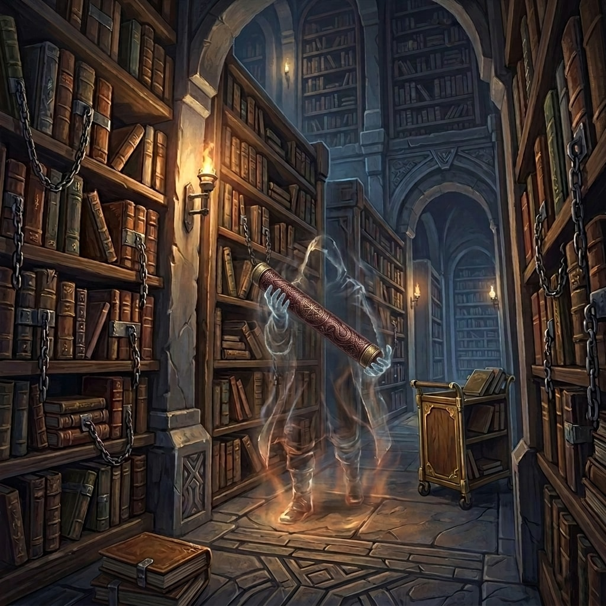

# Preparations and Purple Worms

:::summary
In which our profoundly exhausted heroes retire to the rowdy warmth of the Broken Stool hoping for a quiet supper, only to be subjected to the monumental historical hurdle of a flying dwarven fist and a chaotic tavern brawl. Having survived this dreadful disruption to their dining schedule, they receive an imposing drow ambassador and endure harrowing tales of twenty-foot demonic gorillas, which naturally necessitates a morning spent fiercely—and fruitlessly—interrogating a bewildered tailor for bear traps large enough to snare a mythical worm. Continuing upon this singular, winding journey, the party divides their labors: Scarlet takes restorative waters with an impossibly tall firbolg, while her companions execute an invisible library heist with polite nonchalance, bravely pilfering a geographically irrelevant map of Kraghammer. This casual thievery segues seamlessly into a high-stakes diplomatic supper at the Kryn Embassy, where the party valiantly suffers the freezing indignities of exotic frostworm stew whilst mapping out an absurd, goat-based equestrian itinerary. Having thoroughly solved the logistical doom of their impending expedition—and having magically brainwashed a local father into volunteering his son for certain peril purely to avoid a tedious argument—the adventurers indulge in a final evening of psychedelic harp recitals and highly questionable “holistic decompression” before setting off into the dread Rime Plains, entirely prepared to demand a formal apology from whichever purple worm had so rudely inconvenienced them.
:::

Returning from the royal palace mentally drained and physically exhausted, the party trudged into the familiar, rowdy warmth of the Broken Stool. Finding a table amidst the boisterous throng of off-duty miners, they flagged down Luda, the tavern’s no-nonsense dwarven barkeep. When Kragor inquired about the evening’s fare, Luda offered them standard stew for five silver or, for those feeling flush, proper goat steaks for a hefty gold piece each. Feeling generous, the warlock slapped down the coin to cover steaks for the entire table.

Hoping to earn a little extra coin herself while they waited for their food, Elara took out her harp and began to play. However, the sheer exhaustion of the day’s political maneuverings had taken its toll. Her fingers were sluggish, the melodies uninspired, and the performance felt more akin to an amateur recital than her usual soaring performances. The tavern largely ignored her, the miners returning to their drinks and loud conversations.

The group began discussing the logistics of their impending journey, heavily considering taking a full day to rest before setting out, when a sudden commotion interrupted them. A drunken dwarf threw a heavy punch at a fellow miner, sending the victim stumbling backward directly into the party’s table. Before anyone could react, the assailed dwarf grabbed Scarlet’s mug of ale and smashed it over his attacker’s head. Within seconds, a full-blown brawl erupted, drawing in half a dozen other patrons. Unfazed by the chaos, Luda vaulted the bar with a broom in hand, expertly battering the instigators until the combatants were forcefully ejected into the street. She calmly replaced Scarlet’s spilled beer, apologizing for the patrons’ rude behavior and suggesting they had likely suffered a hard day in the mines.

## The Taskhand’s Invitation

Just as the dust settled, the heavy tavern doors swung open and the room fell dead silent. The Kryn ambassador stepped inside, flanked by two imposing drow guards clad in jagged, jet-black carapace armor bearing subtle, dark dodecahedron insignias. One guard carried crossed scimitars resting across their back, while the other was armed with a sword and dagger. The sight of high-ranking drow nobility in a common dwarven tavern was unheard of, and the miners stared in quiet shock.

Walking smoothly to their table, the Taskhand politely declined Kragor’s offer of a goat steak and a beer. Instead, he expressed his desire to meet with the party to discuss the logistics and timing of their impending journey. He formally invited them to the Kryn Embassy, located on Embassy Row of the Lieberdisk, to plan their expedition over an early supper the following afternoon.

Curious, Elara asked the ambassador about his stoic, heavily armored escorts. The Taskhand explained that they were standard security for an envoy of his standing, assuring the party that the guards were discreet and absolutely trustworthy before he turned and departed.

After the drow left the tavern, an older dwarven patron named Donald cautiously approached the table. He introduced himself as a former caravan runner who used to trade between Uthodurn and Xhorhas. In a hushed, reverent tone, he warned the party about the ambassador’s guards, claiming he had once witnessed warriors of their intimidating ilk in battle against the vicious Jez-Araz orcs. Donald swore that the elite soldiers possessed terrifying magic, capable of being in two places at once.

When Elara pressed the veteran traveler for further advice on their route, Donald’s expression darkened. He strongly recommended avoiding the river through the Savalirwood at all costs. Shuddering at the memory, he recalled that some of his old caravan crew had claimed to see an udaak in that region. When Elara asked what such a creature was, Donald described a monstrous, demonic cross between a four-armed gorilla and an ox that stood twenty feet tall. With its four glowing red eyes and a yawning, neckless maw full of jagged tusks, the udaak was a terrifying beast he prayed he would never have to face himself. He fervently advised the group to bring as many guards as possible on their journey and to secure swift horses to cross the open Rime Plains.

With Donald’s dire warnings fresh in their minds, the day’s accumulated exhaustion finally overtook them. The party thanked the veteran traveler for his advice, retreated to their rooms at the Broken Stool, and went straight to bed for a much-needed rest.

## Morning Errands and a Heist

The party awoke the next morning to an unceremonious breakfast, having paid a younger dwarf five silver pieces to fetch them food. After eating, Therin set out alone to scout Embassy Row, finding that the Dwendalian Empire, the Menagerie Coast, and the Kryn Dynasty all maintained massive, walled-up buildings protected by heavily armed guards.

Meanwhile, Elara, Doctor Pepe, and Kragor headed to Padillia’s to retrieve the warlock and bard’s newly tailored studded leather armor. While the shopkeeper frantically called for her assistant Borrick to help manage the bustling shop, Doctor Pepe casually inquired about purchasing heavy bear traps to catch a purple worm. Flabbergasted, Padillia pointed out that bear traps were only suitable for catching things the size of bears. This simply reminded Kragor that they still needed to acquire a yeti pelt for a bag of holding, leading the warlock to eagerly ask if the traps would work for yetis instead. Ultimately, they left the confused tailor without buying any traps at all.

Across the city, Scarlet sought out the local shrine to the Wildmother. Following a worn, winding staircase, she discovered a breathtaking hidden grotto where divine magic allowed lush greenery to thrive deep underground. There, she met Thornweaver Mosscord, an eight-foot-tall firbolg caretaker with moss growing through his hair and beard, clad in roughspun robes and completely barefoot. Feeling wonderfully small in his presence, Scarlet offered a devoted prayer to the Wildmother, leaving behind a folded paper owl and her treasured copy of *Tusk Love* on the altar. “Moss” chuckled warmly at the offering, gifted her a proper herbalism kit, and invited her to drink from the shrine’s healing spring. As the restorative waters washed over her, Scarlet opened up to the firbolg, sharing the bewildering story of waking up on a boat with no memory and eventually meeting the party. Moss listened intently, admitting he had never seen a boat. He revealed that he originally hailed from the Savalirwood, but when Scarlet asked what had happened to the forest, he simply and solemnly replied, “Magic”. Urging her to continue her service to the Wildmother, he left her to her devotions.

While Scarlet prayed, Doctor Pepe formulated a reckless plan to infiltrate the restricted stacks of the Vellum Steeple. Discussing the heist beforehand, Kragor agreed to create a distraction—even offering to use his telekinesis to knock over an inkwell if things went south. Arriving at the grand archives, Kragor occupied the dwarven desk attendant, Borant, by inquiring about his commissioned research. Borant produced a ledger detailing the Mawcotters, revealing them to be a fanatic clan related to a cult in Eiselcross who gained power by consuming the flesh of Quajath, the ancient Undermaw—a terrifying scout of Torog from the time of the Calamity. Those who consumed the flesh were known as wormkin.

While Borant was occupied explaining this grotesque history to Kragor, Elara lingered just outside the grand doors of the Vellum Steeple, plucking a soft, vanishing melody on her harp to weave a veil of invisibility over Doctor Pepe. She then casually strolled inside to join the warlock at the desk, allowing the unseen rogue to slip through the heavy doors right behind her. Once inside, Doctor Pepe crept silently past the front desk, carefully stepping over the low barrier that separated the public lobby from the restricted archives, and faded into the vast, cavernous stacks. Faced with an unorganized sea of chained books spanning an area half the size of a football field, he activated his enchanted ring of comprehend languages to rapidly decipher the foreign titles. Blindly navigating the rows, he bumped a library cart at one point, holding his breath, but no one noticed. Continuing on, he finally found a section dedicated to history, uncovering texts regarding the Zemnian Fields. There, his eyes landed on a beautifully hand-tooled leather map case. Snatching it from the shelf, the invisible rogue quietly waited by the exit, slipping back out to the street right behind Kragor and Elara as they concluded their business and opened the heavy doors to leave.

Reconvening with Kragor and Elara outside, the trio went to fetch Therin from Embassy Row before returning to the safety of their rooms at the Broken Stool, where they found Scarlet had already returned from the shrine. Examining Doctor Pepe’s ill-gotten prize, they unrolled a masterfully crafted map of the Cliffkeep Mountains in Tal’Dorei. Both Elara and Scarlet had heard of Kraghammer, the sprawling dwarven city in the south of the map founded right after the Calamity and infamous for its xenophobia and strict classism. While geographically useless for their current expedition into Xhorhas, the map was undeniably a treasure worth hundreds of gold.

## The Embassy Summit

Later that afternoon, the party arrived at the Kryn Embassy. Unlike the guards at the tavern, the sentries at the door were dressed differently, bearing much more elaborate, brightly embroidered dodecahedrons on their livery. After the sentries motioned for them to enter, the party was met by a female drow who escorted them up a flight of stairs and down a hallway to the left. They entered a large dining room where the ambassador sat at a grand table, finally introducing himself fully as Taskhand Serraf Mirimm. He was flanked by his personal guards, who he formally introduced as Echo Knight Vornesh Kasathar and Echo Knight Adrec Olios. When Kragor asked what an “Echo Knight” was, the Taskhand explained that it was a title of high distinction in the Kryn Dynasty, marking them as the most faithful and adept of the Aurora Watch, though they now operated outside it as his personal security. He assured the party they could trust the knights utterly. Leaning back in his chair, Kragor offered a blunt reply: “I will trust them every bit as much as I trust you”. The remark earned a faint smile from the Taskhand. A waiting decanter and glasses were set out for everyone.

The diplomats were served an exotic Kryn meal of frostworm stew—which left a lingering, magical chill in their mouths. Remembering their recent research into the flesh-eating cult of Quajath, Kragor anxiously asked, “Uhm, this isn’t from Eiselcross, is it?” The Taskhand calmly replied, “No, I would not recommend eating worm meat from Eiselcross”. The stew was served alongside charred skewers of mastodon meat and glasses of sweet, purple palm liquor, finishing the meal with bowls of rich rice pudding and gooseberry jam. As they ate, they discussed the route. The Taskhand noted that while the drow preferred traveling by night, they would accommodate their sun-dwelling adventuring companions—as well as the Uthodurnian beasts of burden—by traveling during the day, though he requested they set out in the latter half of the day to avoid the most punishing sunlight.

Laying out the options, the Taskhand assured them that the Boroftkrah orcs would not bother them. However, Kragor pointed out that he had heard the Jez-Araz orcs could mean serious trouble. Acknowledging the threat, Serraf Mirimm laid out the fastest route: crossing the mountains and the river east of the Ivory Lake, passing close to the ruins of Uraliss, which would likely take a ten-day journey. However, he warned that riding across the flat, open Rime Plains meant they could be spotted from miles away.

Alternatively, they could travel west, closer to the Savalirwood. This path would successfully avoid the Jez-Araz, but would force them to contend with the magical corruption bleeding from the wood. By following the river downstream and taking boats across the lake, they could potentially save a day of travel. Therin proposed a hybrid approach: utilizing Uthodurn’s sure-footed Flot goats to quickly navigate the mountain passes, having an Uthodurnian escort return the goats, and bringing along faster horses to cross the flat plains.

The conversation soon shifted to the ambush. Desperate to understand the circumstances surrounding the loss of their massive mount, the Taskhand diplomatically but persistently pressed the party to recount the attack once more, drawing out every specific detail he could. When the party reiterated the presence of the crimson rider and the slavering shadowghasts, Serraf Mirimm firmly asserted that the Kryn Dynasty utterly despised undeath. He expressed deep concern that a rogue necromancer might have somehow gained access to a Kryn purple worm—an act he deemed nearly infeasible—solidifying their shared purpose in investigating the mystery. After the group decided to take their chances with the Rime Plains using Therin’s goat-and-horse strategy, the summit concluded with an agreement to depart the following afternoon. As a final gesture, the Taskhand presented the party with a metal medallion bearing the crest of the Dynasty to ensure safe passage, which Kragor quickly pocketed.

Before retiring for the evening, the group visited the Coalvein residence to tell Brennik about their upcoming expedition and to see if they could get him assigned to their detail. They arrived to find Torvin loudly complaining that his son had nearly died, angrily asking why Brennik couldn’t just be a miner. Interrupting the argument, the party was pleasantly surprised when Brennik revealed that he had already been officially assigned to accompany them alongside Hilda. Despite this, Torvin remained adamant that his son needed more rest. Before the argument could escalate further, Kragor subtly wove an enchantment over the stubborn father, magically convincing Torvin that joining the expedition was truly the best path for his son’s recovery.

With Torvin placated, Therin explained his elaborate goat-and-horse travel plan, leaving Brennik looking highly skeptical of the logistics. Seizing the awkward silence, Doctor Pepe innocently asked Brennik if he knew of any good spots for “holistic decompression”. The young dwarf thought for a moment and began to earnestly recommend the serene Temple of the Wildmother. Clarifying his needs, Doctor Pepe explained he was feeling particularly stressed in “one region,” specifically “somewhere where the silk meets the stone”. Brennik simply stared back, the colorful euphemisms failing to land completely as he had absolutely no idea what the rogue meant.

## The Underrest

With their journey secured, the party split up to enjoy their final night in the subterranean city. Back at the Broken Stool, a helpful local finally pointed Doctor Pepe toward an unmarked brothel near the elevator shaft, leaving the rogue to happily seek out his “holistic decompression”. Meanwhile, Kragor returned to his room to make additions to his magical tattoos. Before parting ways, Elara announced her intention to visit the high-class Underrest with Scarlet and asked Kragor for the official Friends of the Court medallion. The warlock happily handed it over. Therin decided to simply retire early and get a good night’s rest.

Elara and Scarlet ended the night on a high note by visiting the Underrest, the exclusive, high-class club on the Grand Disk. Entering a beautifully appointed room filled with crystal chandeliers, thick rugs, and hushed aristocratic conversation, they approached the attawan maitre’d. When Elara confidently announced her intention to perform on the empty stage, the attendant was visibly skeptical. He offered her a meager glass of sparkling water after giving her a blank look regarding her mocktail request, while Scarlet happily paid for a glass of fine elven liquor. 

Taking the stage, Elara decided to leave nothing to chance. She wove an illusion: a mesmerizing, shifting sphere of psychedelic light floating just behind her, projecting kaleidoscopic colors and geometric patterns into the dim room. As her fingers struck the harp strings, she poured every ounce of her remaining energy into the performance, filling the room with a song including the verse “Everybody wants to rule the world”. For an audience of diplomats and nobles acutely aware of the brewing war between their neighboring super-powers, the poignant lyrics struck a powerful chord. The magic and music intertwined perfectly. Patrons stopped their conversations, drawn to the stage by the soaring melody.

By the end of the evening, the bard had collected eighteen gold pieces in tips as well as numerous calling cards. As she stepped down from the stage, Minister Ërethyn Galewing approached her from the crowd. The Mistress of External Affairs pressed a final gold piece into Elara’s hand, thanking her for the music and solemnly reminding her how much the Diarchy was counting on them to keep the peace with the Dynasty.

## Final Preparations

The following morning, with their afternoon departure looming, the party made their final arrangements. Kragor made a trip to the Plexus Post to sell off some of their acquired items. While there, he asked Ava about finding an enchanter that could work with musical instruments. Ava asked the warlock to hold on a moment while she dug through her inventory. She emerged carrying a rare, enchanted Canaith Mandolin, priced at a staggering four thousand gold pieces. While it was undeniably a fine and powerful instrument, Kragor knew that Elara preferred the harp, flute, and hand-drum. Recognizing that her current stock wouldn’t suffice for custom, high-end enchantments, Ava suggested they would eventually need to travel to a larger city and recommended going to Rexxentrum to seek out the renowned Pumat Sol. The warlock thanked her for her time and left.

Elsewhere in the city, Scarlet spent her remaining morning hours putting the herbalism kit she had received from Moss to good use. Relying on her practiced proficiency with the tools, she carefully brewed a fresh potion of healing, securing the magical restorative in her pack.

With their errands complete and their supplies secured, the party finally gathered together. They had navigated the tense political labyrinth of the Diarchy and the Dynasty, emerging with diplomatic backing and a clear objective. Now, they were ready to leave the subterranean safety of Uthodurn behind, meet with their respective escorts to arrange their mounts, and face the harsh, untamed expanse of the Rime Plains, determined to discover the secret behind the missing purple worm.
