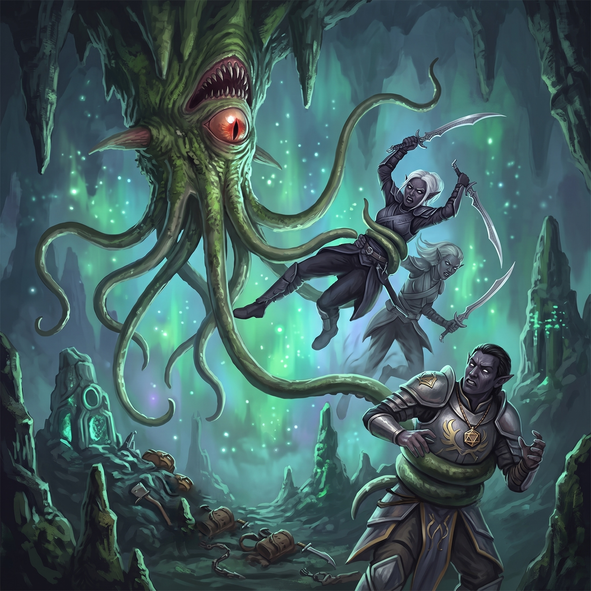

# The Underdark

The world narrowed to a throat of stone and then swallowed them whole. Behind and above lay the freezing gorges of the mountains; ahead lay only the dark, vast and patient and older than any surface reckoning of time. The party moved down through it in a loose column, and at its head the Taskhand offered his counsel in a low voice that the stone seemed to drink.

They were, he explained, travelling as guests of a well-regarded house. The Kryn Dynasty commanded respect in these depths, and so long as they conducted themselves with sense, the civilised peoples of the Underdark would let them pass unmolested. Light, however, was another matter. A bright lantern or a conjured flame was a beacon down here, an announcement to every hungry thing in the dark that soft-skinned travellers had come blundering into its larder. In its place Serath conjured a scattering of dim, violet-tinted lights that clung to the column like drowsy fireflies—enough to walk by, not enough to advertise. Caution was to be their watchword for now, though he allowed, with the diplomat’s careful economy, that they might find friends nearer the end of their road.

Kragor received all of this with the barely-contained delight of a man who had waited his whole life to visit a place everyone sensible had warned him against. He wanted to see the Faerzress Fields, he confided; he wanted to walk beneath the towering caps of the Zurkhwood Groves. That these lay somewhere far ahead, unpromised and unreached, did nothing to dim his enthusiasm. Aedric, meanwhile, ranged some fifty feet in advance of the orc, a silent shape at the edge of the purple gloom, the two of them bound by a thread of telepathy so that whatever the echo knight found in the dark, Kragor would know of it in the same breath.

## A Harvest in the Dark

The tunnels opened into cavern after cavern, some of them cathedral-vast, and for a time the walls turned wet and treacherous underfoot, water beading on the stone and making every step a small negotiation. It was here that Elara noticed a cluster of pale, barrel-shaped growths swelling from a fissure, and beside them a knot of clear, gelatinous orbs that trembled like held breath. She put the question of them to the Taskhand.

Serath studied the fungi a moment, as though he had walked past their like a hundred times without truly seeing them, and then agreed they were worth the harvesting. The barrels, he said, made decent eating; the orbs held clean water within their membranes. At the word, Kragor reached out with his will and plucked one of the trembling orbs from its cluster; it drifted across the dark toward him, unhurried, and settled into his waiting palm as gently as if he had cupped it from a still pool. The company set to gathering the rest, and paused to take a meal in the violet dark—a small, unhurried civility in a place that offered few of them.

## The Bone-Field

They heard the river long before they saw it: a low, continuous roar that resolved, as they rounded a shoulder of rock, into a broad black watercourse churning through the cavern. On the flat ground beside it lay a scene of old violence. Bones—six, perhaps eight sets of them, humanoid and long-since picked clean—lay scattered across the open ground, threaded through with rusted blades and the crumpled remains of armour.

Aedric read the tableau with a soldier’s practised eye. This had been a battle, he judged, and an old one: duergar against drow, two grudges of the deep settling accounts on this nameless bank. The party picked through the wreckage with due respect and due pragmatism, and came away with a pair of serviceable shortswords, a warhammer, and a modest purse tallying twelve gold, three silver, and a single copper—the last small wages of soldiers who would collect no others.

By now they had put a full day’s march behind them, and the Taskhand raised the matter of pace. In country such as this the Kryn were accustomed to pressing on past the ordinary halt, stealing an extra shift from the endless night. The party agreed to match them—though agreement and endurance proved different currencies. Doctor Pepe felt the miles settle into his legs like wet sand; Brennik’s cheer thinned to grim silence; and Scarlet, who belonged to open sky and green growing things, felt the sunless weight of the deep settle into her bones and refuse to lift.

## The Crossing

The river, at least, would not be argued with. It had to be crossed, and so Scarlet gave herself to the water, her small halfling frame flowing outward into the boneless bulk of a giant octopus. She poured herself into the current to take its measure: cold, some eight feet deep, a good forty across—and, she realised as she coiled through it, well within her strength to bridge. She returned to the bank, where Doctor Pepe pressed a coil of rope into a questing tentacle, and carried the line back across through the black water. On the far side the echo knights did what echo knights do: the air folded, their violet duplicates flickered into being on the opposite bank, and the pair traded places with them in a heartbeat to make the rope fast.

Then came the rest of them, hand over hand through the freezing dark, and the river extracted its tolls. Brennik took a mouthful of it at the worst moment and hung there coughing and retching, half-drowned before he’d fairly begun. Doctor Pepe and Therin lost their grip entirely and were plucked away downstream, swept into the roaring dark—until Therin’s form blurred and reassembled on the bank in a wisp of displaced air, and a long grey tentacle shot out of the current to close around the floundering rogue and haul him bodily back to the line. Bedraggled and counted, the company gathered itself on the far shore and pressed on into its stolen shift.

Some way farther on, the dark ahead was no longer wholly dark. A faint luminescence gathered as they walked, growing with each turn of the passage until the stone around them glowed softly of its own accord—fungus threaded through the rock in veins of pale light. Faerzress, at last, and with it good clean illumination and food for the taking. Kragor’s delight was cut short. Some way ahead, at the ragged edge of the glow, Therin caught the suggestion of movement.

## Ropers

The warning arrived, as such warnings often do, a half-second too late and inside Kragor’s skull. Aedric had been struck. Something had lunged out of the stone and closed on him with appalling force—a wound that would have felled a lesser man—and as Kragor turned, the echo knight folded space and swapped past the thing to strike at it from behind. His duplicate rained down four blows and found nothing but rock; for the creature, they now saw, was very nearly rock itself: a great tapering column like a stalagmite grown wrong, sprouting a crown of long, prehensile tentacles.

Kragor reached out with his will and tore Aedric free of the grasping limbs, then flung a bolt of eldritch force that guttered wide into the dark. It was Serath who named their enemy. “It’s a roper!” the drow called, already shaping a mace of glowing violet light in the air. “Beware its tentacles!” The spectral weapon swung in and cracked against the creature’s flank—and hard on the heels of that first honest wound came a chorus of failures. Brennik’s heavy bolt struck true and skipped off the stony hide as though he’d shot a cliff. Vornesh moved to put herself between the thing and her Taskhand, cast her echo forward, and hurled a spear that found its mark and simply rebounded.

Worse: they were not facing one. A second roper unfolded from the ceiling, a stalactite come hideously alive, and its tentacles lashed down to seize Vornesh’s echo and haul the violet figure up toward the dark vault above.

Then a third dropped into the fray and fastened on Vornesh herself, dragging her in against the grinding column of its body and biting down savagely. For a moment the encounter tilted toward disaster—thrown spears and crossbow bolts glancing off stone, three armoured predators reeling the company in one by one.

The party answered with everything it had. Elara drew the ornate, brass-capped rod recovered from the dead wizard’s study and levelled it at the nearest roper; it spat volley after volley of unerring darts, each one punching into the stony hide without fail. Between them she caught up her flute and flung courage into her allies like a handful of sparks—three rising notes that climbed the spine and put strength back into tired limbs. Therin loosed searing rays that hissed across the dark and burst against stony flesh. Scarlet conjured a puma from the wild—a lean, summoned hunter she named Tiny—and sent it loping into the fray to worry at the ropers; then she took a shape of her own, pouring herself into the sinewy bulk of a moorbounder—swifter than nearly anything that runs on four legs. Where a roper clung to the vault overhead, high above the reach of any blade or claw swung from the cavern floor, the great cat gathered its haunches and sprang, launching clear off the ground in a single impossible bound to rake its claws down the stony flank before dropping back to the stone in a low crouch. Between such leaps it flowed from target to target, tearing chunks from the creatures’ hides while Tiny harried them alongside her. Through it all Kragor worked his particular sorcery of leverage, conjuring the churning storm of spectral daggers he called his “maelstrom of madness”—blades that pierced not stone or hide but the mind beneath, and that he could blink from one grinding column to the next with a thought—and with his telekinetic grip he wrenched his companions free of the tentacles again and again—Vornesh, Serath, Aedric, whoever the deep reached for next. His own dignity fared worse. When one of the ceiling-clinging ropers snared the orc and hauled him up toward the vault, he tore loose by main strength alone—and, with nothing beneath him but air, dropped hard to the cavern floor and landed in an ungainly heap. Serath had been dragged up in the same grip, and Kragor, reckoning a short fall the kinder fate beside a roper’s jaws, reached up with his telekinetic will and hauled the Taskhand down after him—the drow crashing to the stone alongside the orc, jarred but unbitten.

The drow fought with the grim economy of professionals. Serath’s spectral mace hammered down between his healing words; he laid a curse of failing luck across the creatures, and later spoke a word of command into the dark that the eldest of them shrugged off. Vornesh worked her poisoned scimitars and her rebounding spear with silent fury, conjuring echo after echo as the ropers bit them to smoke, until at last a thrown spear found the joint of the second creature and punched clean through, and the thing shuddered and went still.

By then the first had already fallen—Therin’s rays finishing what Elara’s barrages had begun, the roper sagging and cracking apart in the violet light. That left the eldest and largest, and it did not sell itself cheaply. It grappled and bit and reeled the company in even as they hacked it down: Vornesh’s scimitars opening it thrice over, Brennik and Doctor Pepe’s bolts thudding home at last, Elara’s arrows scoring it while the ceaseless bite of Kragor’s maelstrom gnawed at its reason, Serath’s fire and Therin’s flames searing its stony hide. It seized the moorbounder and the drow in a final spasm of malice, and it was dying even as it did so, the spectral daggers still turning in the air about its head. Therin lifted his hand and called down a mote of sacred flame, and the last roper came apart in radiant fire and was still.
