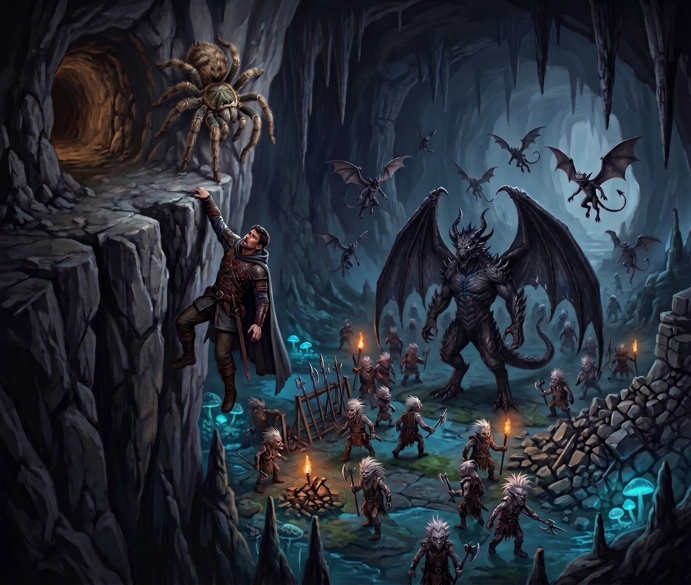

# Under the Ivory Lake

:::summary
The companions pick over what the jellies left. Oozes do not spend money, so whatever the jellies have been eating, they have been eating it purse and all. Scarlet takes a rat’s shape and finds the trove: drifts of chewed bone, a heap of loose coin, a scatter of rusted steel, and one short knife still bright. Brennik tastes the cavern wall, knuckles it, finds the thin spot, and opens it with one swing of his warpick. Scarlet spends the short rest on the knife: nothing it cuts stops bleeding. It goes to Doctor Pepe.

They follow the failing vein under Ivory Lake to a chimney deep enough that a dropped lantern falls for two full seconds before the sound comes back. Vornesh goes first, by echo; Scarlet walks down as a giant spider and spins a web to catch a fall; the rest come down the hundred and eighty feet, and only Brennik is badly hurt. They camp a quiet night in an alcove and go on down. Then the air begins to press. Elara carries a dread she cannot put down. They hear giggling, then hammering, then scrabbling they cannot place.

Invisible thanks to Elara’s magic, Doctor Pepe scouts a well-worn path, and something winged passes him in the dark muttering _“Smell wormkin, no worm.”_ Below lie a butchered myconid, a derro grumbling to itself, and at last a war camp: bundled weapons, piled stone, derro in their dozens, flying things that talk, and an eleven-foot creature with a bat’s wings at the center of it. Doctor Pepe’s footing goes, and with it any chance of leaving quietly. Kragor gives him up for dead; Scarlet, furious, corrects him mind to mind, and Vornesh hauls the rogue off the ridge in a cradle of web. They run, sealing the passage behind them with spectral daggers and cold silver light, and are still running when rocks come tumbling out of two openings in the wall ahead.
:::

The tunnel still smelled of dissolved jelly, an ammoniac sweetness that got into the back of the throat and stayed there. Elara, Kragor, and Therin went through the remains anyway, sifting the spreading pools with boot-toes and blade-tips, and came up with three gold pieces, two silver, and a pair of semi-precious stones likely worth about twenty-five gold apiece—all of it tacky to the touch, and all of it requiring a wash afterward.

It was Kragor who said the obvious thing out loud. Oozes do not spend money. Whatever the jellies had been eating in these holes, for however many years, they had been eating it purse and all. There was a trove somewhere near.

Scarlet folded herself down into a rat and went to find it.

The crevices ran back further than they looked. She smelled her way through them, which was a novel and deeply informative experience, and not far in she came out through a small opening into a space floored with bone slivers—chewed white, ankle-deep to a rat, the leavings of countless meals. Exploring the many passages, she came across the hoard: a heap of loose coin amounting to a hundred and fifty gold or near enough, a scatter of small steel implements—daggers, mostly—eaten down to rust, four more semi-precious stones, plus a ruby and a diamond. Lying among the ruined daggers was one short knife, unpitted and bright, as though it had been ground that morning.

She packed the gems into her cheeks, went back out the way she had gone in, and spat them one at a time into Therin’s waiting palm.

Kragor put the question to Brennik: how long to get through five or six feet of rock?

“Oh,” said the dwarf. “About two days.”

So Scarlet-rat went back in for a closer look at the passages while the rest of the company worked the cavern wall for a thinner spot. The others hunted by eye and by lantern-light. Brennik listened… _felt_ for one. He chipped a fragment loose with the pick of his warpick and licked it, which the others let pass; he knocked along the stone with his knuckles and then with the haft, turning his head to listen to what came back. None of it struck him as worth explaining. It was only how a dwarf looks at a wall. At last he announced that here the wall was two feet thick and that he could get through it. He set his feet, swung once, and a slab the size of a door came out of the cavern wall and fell in pieces at his boots.

Scarlet-rat dropped the shape and climbed through the gap. Kragor reached in telekinetically and relayed the hoard out piece by piece—the coin first, then the knife.

They took a short rest back in the larger cavern, and Scarlet spent hers with the knife. It was a plain thing, hilt to point, and it took her the better part of the hour to work out what it was. Any wound it opened went on bleeding. A second cut laid over the first bled twice as hard, and a third worse than that, until somebody bound it or prayed it shut. And it opened wounds in anything that had a body to wound, the walking dead included—even the old and terrible ones that plain steel scarcely marks, and some it does not mark at all.

They gave it to Doctor Pepe. He tried the edge against his thumb, said nothing at all, and put it away. Then they went on.

## The Fading Thread

The vein led them down, greying as it went, and they followed it in the green light of their mushroom-lanterns. The stone grew wet, then slick, and water stood in the hollows of the floor. They were under Ivory Lake now, they supposed. The smell fit: a hard mineral reek, like wet lime.

Then the passage opened onto a chimney, and the thread went over the lip and straight down. Doctor Pepe, peering in, dropped his lantern. It fell for two full seconds before a small, distant sound came back up.

Vornesh sent her echo over the edge and stood at the bottom a few seconds later. Scarlet walked down the inside of the shaft as a giant spider—a hundred and eighty feet, lip to floor—and spun a web below to break falls. Elara came down on her wings, taking her time. Kragor lost grip of the rope more than halfway; Brennik lost it sixty feet from the bottom and fell the rest of the way screaming, and hit hard enough that Therin had to press a wash of golden, mineral-scented warmth into the worst of it before the dwarf could stand. The ropes were still tied off at the lip. Vornesh sent her echo back up for them, sparing somebody else the climb.

They made camp in a natural alcove out of the drip-line. Kragor had been wondering about Vornesh all day. His spells came to him in his sleep; one of them was a way to stop wondering. He let his attention settle against her mind, light as a hand laid on a door. What came back was frustration—flat, unadorned, with nothing attached to it that he could name. He withdrew before she noticed, and kept it to himself. The watches passed quietly.

## Worn Smooth

The fungal thread ran on downward, fading and becoming more difficult to follow. The stone dried out beneath them; the water stopped running down the walls; Ivory Lake was behind and above them now.

By degrees, the air became oppressive. There was a strong base mineral smell that could be explained by the damp. There was nothing unusual to be seen, but the hairs stood up on their arms and neck. The passage had not narrowed. They began to walk as though it had.

Elara felt it worst. A dread fastened onto her and would not be shaken loose, and for the rest of that day her hands were a half-beat late on everything she asked them to do.

Around midday, by their reckoning, they heard giggling—high, hysterical, and so faint that it might have been imagination.

Later came the hammering, felt before it was heard—slow and patient, somewhere off in the rock. Kragor asked Brennik for a direction and the dwarf listened for a long while before admitting that the rock was throwing the sound and he could not tell. It sounded like a great open space passing somewhere off to one side. They chose not to go and find it.

Two hours on, they heard scrabbling, and it was not faint. Up and to the left. Or possibly the right. Therin wanted to slow the march and move silently; Kragor and Vornesh put their heads together and elected to hold the pace and simply be quiet about it.

They passed more openings. They caught up with Vornesh at one of them, standing with her fingertips on the wall, working hard to keep hold of a thread that had nearly gone. When they looked closely they saw why. The vein had been scraped. Struck. Broken in places, and not by rockfall.

A little further on, a passage dropped steeply away to one side. Near the mouth of it the vein was worse.

Somebody had to go down and look. Doctor Pepe borrowed Scarlet’s brass goggles; Elara plucked a soft, vanishing melody, and he went out of sight between one note and the next.

The passage was a natural cavern, sloping and winding, and its floor had been worn smooth down the middle. Something used this road, and used it often.

A hundred feet down he began to hear muttering, and giggling, and once a shriek. Another hundred feet and there were wings very close to him in the dark—and then behind him, climbing back up the way he had come, toward the party.

Therin heard the flapping come up the passage and stop. Nothing happened for a minute, and then for another. Then the sound withdrew.

Doctor Pepe started back. The flapping returned, coming down at him now from the party’s side, in a stretch where the passage ran twenty feet wide. Something went past him in the dark, close enough to move the air, and as it passed it muttered in perfectly serviceable Common:

*“Smell wormkin, no worm.”*

He finished the climb and told them what was down there. Scarlet took the giant spider’s shape again and went up onto the ceiling, and the company started down the well-worn path together, following him and Vornesh’s echo at a crawl. Then Vornesh left the echo standing behind them to watch their backs.

Six hundred feet beyond the furthest point Doctor Pepe had reached earlier, the tunnel split, the smaller way running down and to the right.

Therin found the prints. Small humanoid feet, bare or nearly so, going down the small tunnel; the same feet in the main tunnel, and alongside them claw marks fifteen inches long. Scarlet-spider crouched over the prints a while. The freshest tracks followed the path going down.

_“Heh. Heh. Shut up. Shut up,”_ echoed a voice in the small tunnel.

Doctor Pepe went down after the voice. Around the corner he nearly went headlong over a myconid, taken apart with great thoroughness and no hurry at all. Past the body the tunnel steepened and ran straight as far as his augmented eyes could see. He went on a little way and found the owner of the voice: a small humanoid in leather armor, its white hair standing up in spikes, combing the floor and grumbling to itself about something it could not find. It gave up, muttered once more, and headed on down the tunnel.

Doctor Pepe came back and described the humanoid with the spiked hair. Vornesh and Brennik looked at one another. “Derro.”

## Dozens and Dozens

The party went down together, quietly. The tunnel forked again, and the voices ahead had multiplied—many of them at once, and one that carried the unmistakable tone of authority.

Doctor Pepe woke the enchanted ring on his hand and the Abyssal came through as plain speech. Elara’s magic let go of him as he did so, and he was visible again, with nothing to hide behind but the dark. Vornesh, listening beside him, picked out Undercommon as well. There were dozens of throats down there. Doctor Pepe would have to get closer. Before he went, Kragor reached out with his mind and forged a silent link with Scarlet-spider—a cold quiet at the back of both their skulls—so that whatever she found, she could say it to the orc without a sound. Doctor Pepe and Scarlet-spider eased into the right-hand tunnel; the rest of the company held at the fork. A little way along, Doctor Pepe found himself looking down from a ridge into a cavern.

It was a camp. Bundles of weapons lay stacked along the walls with piles of stone beside them. Derro moved through the camp in their dozens and dozens. Winged things went back and forth overhead, holding conversations. And at the center of it stood a creature eleven feet tall with a bat’s wings folded at its back, presiding.

Doctor Pepe leaned out for a better look, and the gravel went out from under his boot.

He came down the slope in a small clattering avalanche, got one arm wedged into a crack at the lip of the ridge, and stopped there, hanging over a war camp by a wrenched shoulder.

*“What the fuck is that!”* said several voices, in at least two languages.

Scarlet-spider reached the top of the ridge in time to watch him go over the edge. She reached into that cold quiet and put it to Kragor plainly: *We’re going to have to replace the rogue.*

*We’re running,* Kragor answered. He turned to the group. “Doctor Pepe is dead. We need to go.”

Vornesh’s echo went down the passage at a dead run to see what had gone wrong. Vornesh drew her scimitars. Kragor, Elara, and Therin were already turning back up the tunnel.

Doctor Pepe hauled on his trapped arm and failed to get a leg over the lip.

Scarlet-spider was back in Kragor’s head, furious: _You idiot! He needs help!_ Understanding dawned and Kragor shouted at the others through his chagrin: “Wait! He’s alive! ALIVE!”

Brennik set his feet in the passage and hefted his warpick. This, he had decided, was where the derro stopped. Elara and Therin halted their retreat and prepared to engage any enemy coming from the cavern.

Below, the winged thing said: _“Kill him!”_ The cavern filled with the noise of wings and running feet, and an arrow came up from below and scratched Doctor Pepe across the ribs. Frantically, Scarlet-spider spun a sort of cradle out of her web, and slung it around the rogue.

Vornesh swapped with her echo, arrived on the ridge, took in the situation in one look, and hauled the whole web cradle up over the lip with the rogue still in it.

Doctor Pepe got his feet under him and ran, and Scarlet-spider ran with him, upside down along the ceiling. Vornesh swapped back a second time, nudged Brennik hard enough to move him, and fell in alongside Kragor. Elara and Therin gave up the line and went with them. The whole company went back up the well-worn path at speed, with the sound of wings gaining behind them.

At a narrow place Kragor turned and set a cloud of daggers spinning across the passage—a few feet of air gone to whirling spectral blades, turning and turning, cutting whatever came into them. Scarlet-spider, still up on the ceiling, called a shaft of cold silver light down behind it, filling the gap wall to wall.

The pursuit arrived and did not come through. They heard Abyssal from the far side, furious and unmistakably arguing. Three or four derro were sent into the barrier anyway, or went of their own accord; the company heard them reach the blades and the light, and heard them stop.

They reached another fork, laid down both barriers a second time, and ran on down the main passage.

Ahead of them, rocks came tumbling out of two openings in the wall…
