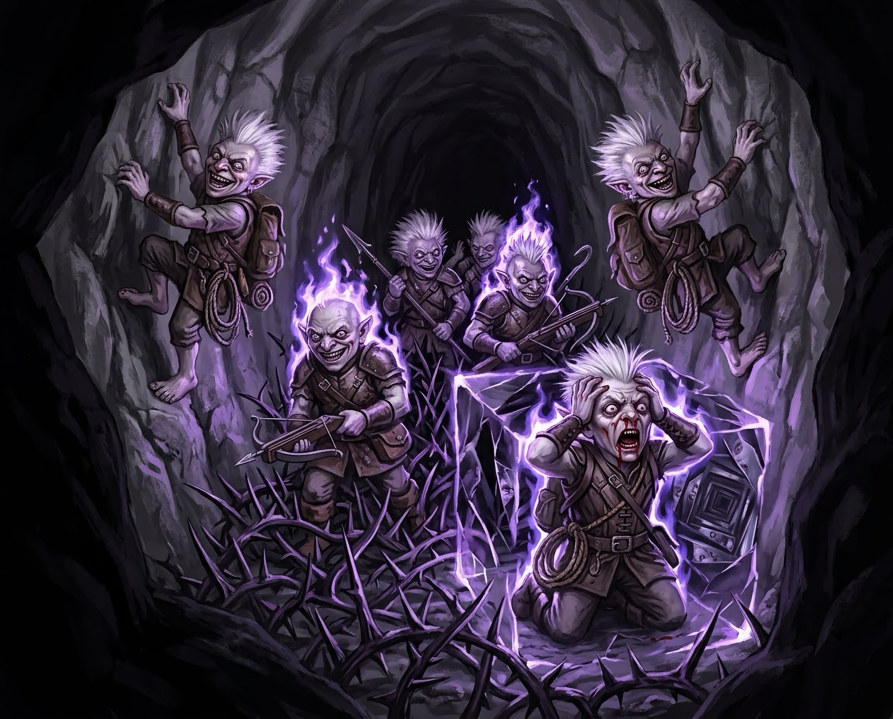

# The Hunting Party

::::summary
Nothing follows the tumbling rocks out of the wall—Vornesh blames the fresh holes on umber hulks—and the companions outrun the derro before stopping to take stock. Doctor Pepe and Scarlet report that the war camp holds at least fifteen derro and, at its center, a daemon. Vornesh sends word of the camp to Taskhand Serath Mirimm. That night, for the first time in months, Kragor dreams that he is buried alive beneath earth and ice, and words in no language he knows form in his head: _“You flee. No matter. I may transact.”_ He wakes feeling dirt in his throat, mistakes the illusory rubble Elara has hummed across the entrance to their camp for a real cave-in, and cracks his head on the wall trying to dig his way out. In the morning, Vornesh reveals her orders: once the companions reach their destination, she will leave them and go back to investigate the war camp. At the end of a hard day’s march, as they come out of a narrow tunnel, Therin hears footsteps behind them: eight derro on their trail. The heroes wait in the dark and catch their pursuers in the narrows, where Elara’s song outlines them in violet light, Scarlet fills the passage with thorns, and Kragor tears open a maelstrom around the one in the lead. Vornesh beheads another with a single stroke, Doctor Pepe leaps onto the last with his knife, and Elara silences it mid-word with her rod; not one of the eight survives.
::::

Rocks tumbled out of the wall ahead, clattering across the passage floor and rolling to rest against the far side. The company pulled up short and braced, weapons out, but nothing followed the rocks out.

There were two openings in the wall, round, with raw edges. Something had bored them, and not long ago. With the noise of wings and running feet still behind them, nobody stopped to wonder what. The company ran on past both holes, and the sounds behind them grew fainter, then stopped. They had outrun the derro. A short way beyond the openings, they halted to breathe.

Vornesh asked Doctor Pepe what he had seen, and he told her: the stacked weapons, the piled stone, the flying things, and the tall winged creature at the center of it all. When she asked how many derro, he admitted that he had not got a count, so Vornesh turned to Scarlet. Scarlet was still a spider on the ceiling, linked to Kragor’s mind; she gave her count to him, and he repeated it aloud: at least fifteen derro in the camp, and two of the flying things, each about two feet tall, with greenish skin. Vornesh got through a few more questions this way before asking Scarlet, with strained courtesy, to please come down and be a halfling. Scarlet dropped from the ceiling and transformed by the time she landed.

Vornesh sent her echo back down the passage to stand in the dark and watch the way they had come.

Then she pressed Doctor Pepe for more. What had the voices below been saying? He had gone closer to the camp for exactly that, wearing a ring that turned Abyssal into plain speech. He admitted that once the gravel went out from under him he had panicked, and that apart from several voices wanting to know what the fuck he was, and one ordering him killed, he had not caught a word.

Vornesh studied him for a moment, then asked when he had chosen his profession.

He told her plainly. The Syndicate had tortured his family and robbed them, and he had learned his trade picking its people off, one at a time, in the forest.

Vornesh heard him out and nodded. “The forest. Ah. That explains it. Not much practice in this terrain.”

Scarlet and Doctor Pepe had both seen the creature at the center of the camp, eleven feet tall with a bat’s wings, and both called it a daemon.

Vornesh’s expression tightened. Far to the east, she said, there was a city with a gate that daemons had come through, but nothing like this had ever been found so far from it. They were at least a week’s journey from that city.

Kragor, who had not seen the creature himself, wondered aloud whether a rogue and a druid knew a daemon from a large bat. Doctor Pepe said nothing. He reached into his coat and produced the arrow that had grazed his ribs.

Kragor took it and turned it over in the light, studying the fletching and the head. Then he licked it, shrugged, and handed it back. Nobody asked what he had learned.

Brennik had not said a word through any of this. He was a young Glassblade recruit, who grew up believing that none were more capable than the Glassblades, and he looked from one of them to the next with very wide eyes. The rogue had hung over a war camp by one arm and come back with a report. The drow had heard out the story of his tortured family and answered with a remark about the terrain. The orc had tasted the arrow the way a dwarf tastes stone. They spoke of a daemon and a war camp as calmly as merchants discussing the price of grain, and Brennik began to understand that he had fallen in with legends.

It was the camp itself that troubled Vornesh most. Word of it had to reach the Dynasty, she said, and sending it was her duty; she would tell Serath everything they knew. They were still five days from their destination.

When Kragor asked about the fresh holes they had run past, Vornesh said they were probably the work of umber hulks.

Brennik found his voice at last. He had seen umber hulks before, he said, though he had never run into one, and he described them helpfully: tall, upright, shelled like insects, and in the habit of lurking inside the stone and bursting through the wall at whatever was walking past it.

For the next hour, the company walked down the exact middle of the passage.

They marched on for a few more hours, following the greying fungal vein. The air turned damp again as the passage sloped downward, and it began to smell of swamp gas, more strongly at every bend. Vornesh said this was not uncommon down here and that nobody was to use an open flame. Several of them looked at Therin. They passed the source, a vent in the floor, and the smell faded behind them.

Near the end of the march, Vornesh went quiet and walked for a while with her lips moving and her eyes on nothing. When she spoke again, it was to tell them that word of the camp had reached Serath.

Further on, the passage forked. Their route went one way and the vein the other. The last time the two had parted at a fork, Kragor had argued for the vein and won. This time nobody argued. Their business was the Dynasty’s missing purple worm, and the vein did not lead to it. They left the vein behind.

Scarlet scouted ahead and found a dry chamber off the main passage, with a narrow mouth, and judged it safe for the night.

Once they were inside, Scarlet held out her hand. Doctor Pepe, who had been wearing her brass goggles since he borrowed them to scout the derro, looked at the hand for a while before he gave them back.

Kragor took first watch at the entrance, turning his mother’s chipped iron amulet of Kord over and over between his calloused fingers.

Elara took the second watch. She hummed softly, and a heap of old rubble appeared across the mouth of the chamber, so weathered and dusty that anyone passing would take it for a rockfall from long ago.

For the first time in months, Kragor dreamed that he was buried alive.

It was the old dream: earth and ice pressing down on him, the ice cracking, while he lay unable to move or scream. Words formed in his head in no language he knew, and he understood them anyway, or thought he did:

_“You flee. No matter. I may transact.”_

He had woken from these dreams before with dirt under his nails. This time he could feel it in his throat, packed and dry, and he woke in a panic.

The first thing he saw was the mouth of the chamber, filled with rubble. Elara was humming somewhere nearby, and he did not put the two together. They had been buried alive. He went for the rubble.

Elara knew what was happening. Back in Syrinlya, when Kragor first told them about the dreams, she had promised to stay close and keep watch. She threw herself at him to stop him, and bounced off. Kragor’s arms went through the rubble as though it were not there, which it was not, and his forehead hit the solid rock at the edge of the opening with a crack.

He sat down hard, holding his head, and looked out through the rubble at the empty passage beyond.

Elara asked whether it had been the dream again. He said that it had, and that he did not want to talk about it.

## Footsteps Behind

In the morning, Vornesh laid out her orders. She was to finish the mission as quickly as possible, then come back and learn more about the creatures in the camp. Once they reached their destination, she would leave them, and unless somebody chose to come back with her, they would be on their own.

They set a hard pace, hoping to cut a day off the journey and put as much distance as they could between themselves and the war camp. The Faerzress came back as they went, its violet light running in veins through the stone. At the next fork, one way went straight on and the other went down, and from somewhere below came the sound of running water. That was their way.

Before long, a black, fast river crossed their path. Elara, of all of them, was the one who slipped at its edge. She was nearly in the current before her wings snapped open and carried her clear. Vornesh sent her echo across to tie off a line, and the rest of them crossed hand over hand above the water.

Beyond the river, the path climbed for a long while. On the right the ground fell away in a steep slope into nothing, and they kept close to the left wall until the path leveled out into a narrow, high-roofed tunnel.

Toward the end of the day, the walls fell back and the company came out of the narrows into an open chamber. They had gone only a little way into it when Therin stopped and raised a hand. He thought he had heard footsteps behind them, several sets of them. He told Kragor, Kragor passed it to Vornesh mind to mind, without a sound, and Vornesh put out her floating lights.

Whoever was following them would have to come up through the narrows, and the company meant to catch them there, still bunched between the walls. In the dark, they spread out across the chamber, well back from the tunnel’s mouth, drew weapons, and waited.

## Giggling in the Dark

A voice came up out of the narrows, speaking Undercommon, and Vornesh murmured the translation against Kragor’s shoulder:

_“I know they came this way.”_

Then came the giggling: hysterical laughter skittering off the stone, and between the laughs, voices talking to themselves. _“Kill, kill, kill…”_ Eight short silhouettes came jogging up the grade. Vornesh, watching them come, saw that four wore leather armor while the other four seemed better equipped. The leather-clad four looked like ordinary camp guards, and the better-equipped four looked outfitted to range far from camp, perhaps explorers. They jogged straight into the trap.

Doctor Pepe, who had given Scarlet’s goggles back the night before, could see nothing of them until Elara sang. Her voice rose on a bright, ringing note, and violet light bloomed around two of the guards and one of the explorers, picking out small bodies, pale faces, and white hair standing up in spikes. Therin hurled three lines of fire that split among the derro and badly burned one of the guards.

Kragor leveled his magic longsword at the lead explorer, and a small cube of space around it broke open into a maelstrom. Light bent around the cube, and its center looked impossibly deep. Out of it came static, grinding stone, and voices screaming in dead tongues. The explorer clutched its head as blood ran from its nose and ears. Brennik fired a crossbow bolt that bit deep into it.

Doctor Pepe scattered ball bearings across the floor, and Scarlet made the ground beneath the whole party of derro sprout thorns from wall to wall. Elara’s next note was cold and brittle; a shard of ice burst against a second explorer, and the cold caught the lead explorer and a guard as well. Therin barked an order at the lead explorer to grovel, and it dropped to its knees inside the maelstrom, still holding its head.

The thorns cut every derro in the passage. Two of the explorers went up the walls like spiders to get clear of them, laughing and muttering as they climbed. One made for Doctor Pepe; the other went along the wall to get in front of the ball bearings. The kneeling explorer stayed where it was. Kragor tried to shove it aside with his mind, and it held its ground. He struck it with a bolt of force instead, and it never got up again.

Brennik’s warpick and two quick strokes of Vornesh’s scimitars opened up the explorer that had climbed toward Doctor Pepe. Doctor Pepe preferred to see what he was stabbing. He lit his lantern, set it down beside him, and stabbed the explorer dead.

Scarlet dropped onto all fours and became a dire wolf.

In the lantern light, the guards came up out of the thorns onto the walls and struck back. One hit Vornesh’s echo, and it burst into violet light. Another stabbed at Vornesh herself and missed. The last two shot at Scarlet-wolf. The first bolt went wide. The second was true until Elara sang a sharp, discordant note that threw the shooter’s aim off, and the same note steadied her own. She sang a cold note next, and a shard of ice struck one crossbowman squarely; its burst of cold killed both of them on the wall.

The giggling had thinned to four voices. Therin pointed at the guard nearest Vornesh, and a bell tolled in the air around it. The guard’s flesh withered.

The two explorers went for Brennik. One scuttled along the wall and swung at him. The other jumped to clear the ball bearings, came down on them anyway, and fell. It got up and swung at him too. Both missed.

Kragor snapped the maelstrom shut and opened it again. It killed the guard that had struck the echo and caught the explorer that had fallen. Kragor shoved that one with his mind back into the ball bearings, and it went down again.

Brennik’s warpick bit into the explorer on the wall, Doctor Pepe’s crossbow hit it hard, and Scarlet-wolf seized it in her jaws and dragged it off the wall to the floor. Vornesh threw a spear into the last guard and called up a new echo beside the explorer in the ball bearings. The guard struck the new echo, and it burst like the first. Elara pulled out her shortbow and fired, piercing the brain of the guard through its eye.

The giggling was down to two voices. Therin tolled the bell again over the explorer Scarlet-wolf had dragged down; it shook off the sound and stabbed Scarlet-wolf, while Brennik’s next swing at it missed. The other explorer swung at Scarlet-wolf and missed. Kragor opened the maelstrom around it once more, and finally Vornesh took its head off with a single stroke of her scimitar.

That left one explorer, still giggling and still muttering _“kill them, kill…”_ to itself. Doctor Pepe ran at it, leapt, came down on top of it, and drove his knife in. Scarlet-wolf nipped it, and it staggered, barely able to stand. Elara raised her rod. Three darts of force struck it mid-word.

The giggling had stopped.
